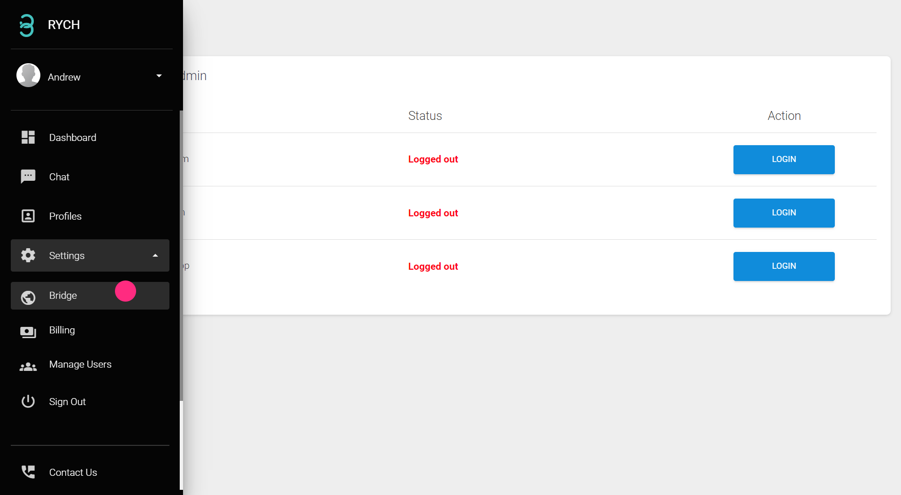
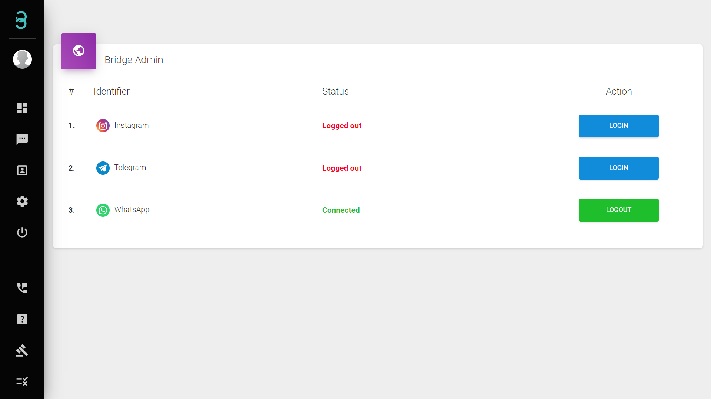

# How do I connect my Social Media accounts into my Rych account?

Step 1: Click on the Bridge word on the menu bar.

Step 2: Select the channel that you wish to bridge and click **Login** then scan the QR code that is displayed on the screen.

Step 3: The green Connected status will appear on the screen, indicating that your channel bridging is successful.

