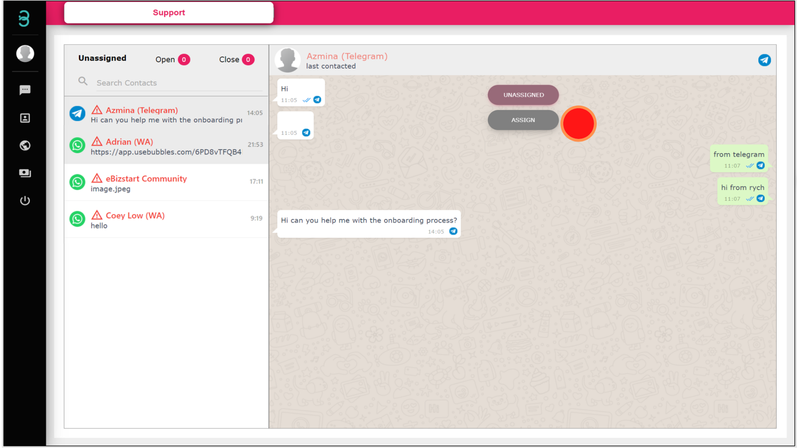
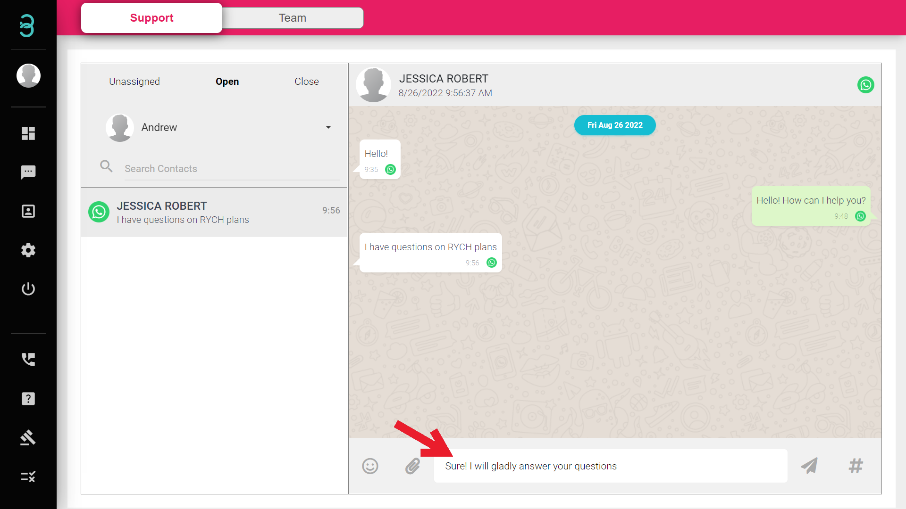
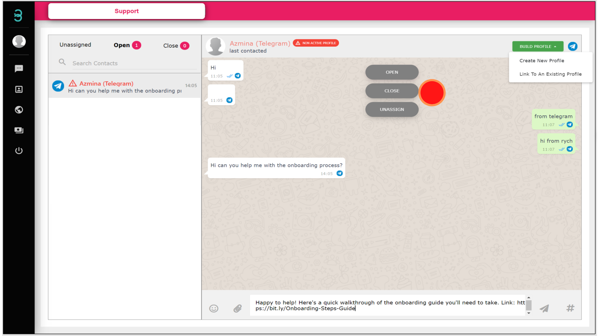

# How do I chat with new incoming chats and close it once I am done?

Guide to manage a new ticket on the Chat Page.

Step 1: Each chat is converted into a ticket in the Unassigned tab. Select which customer you wish to attend and click the **ASSIGN** button to start the conversation with them.

Step 2: In the **Open** tab, you can reply to your customers by sending text, emojis, attachments, and even a voice note to help them solve their queries.

Step 3: Once all of your customer queries are resolved, click the **CLOSE** button to close the ticket.

