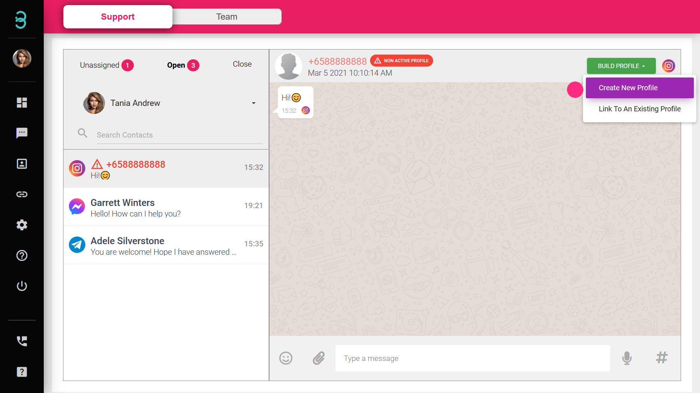

# How do I add a customer profile into my database through the chat page?

Don’t miss out on potential future customers.
Just add their profile while you are chatting with them with these steps.

Step 1: Click on the customer chat box with Red font and then click on the green **BUILD PROFILE** button and click on Create New Profile.

Step 2: Fill in all the required information of your customer and click the **blue Submit** button.

Step 3: Once the profile is created, your customer’s name in the chat box will appear in black text color.

