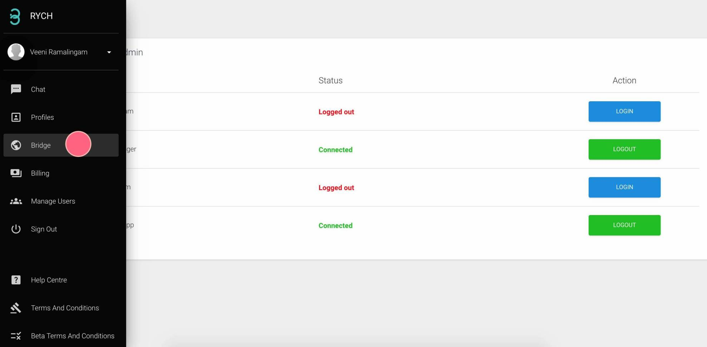
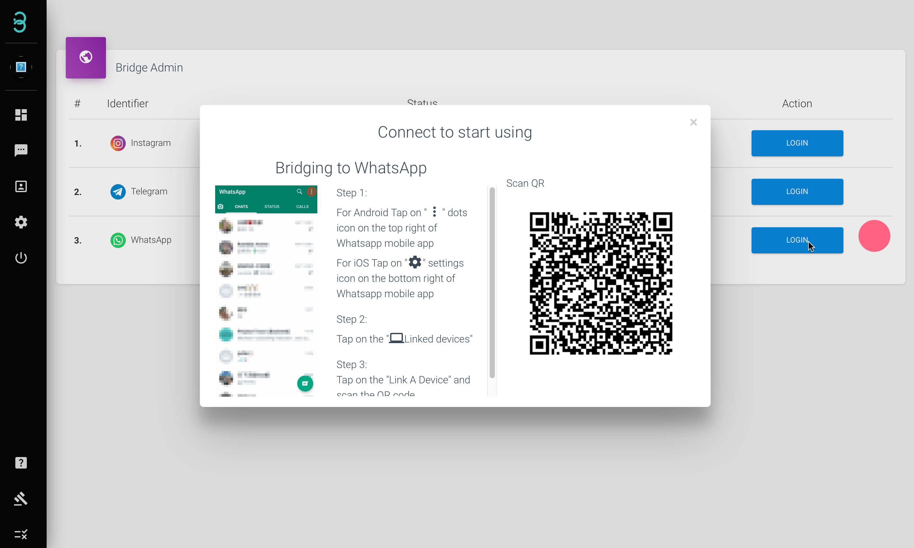
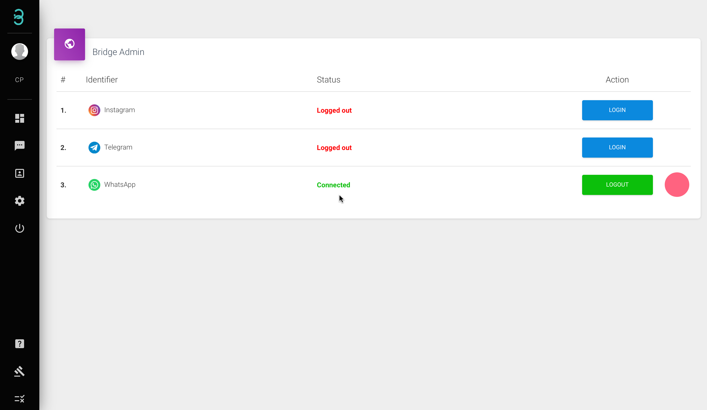

## How do I bridge my Channel accounts with RYCH?

:::info Bridge

Bridging is where you connect your social accounts with RYCH. Scan the QR code or login with username & password and get started messaging your customers with RYCH.

:::

Step 1: At the menu side bar, click on **Settings** and select **Bridge** 

Step 2: Select the channel account that you wish to bridge.

:::caution Please Note :

 To bridge **Instagram**, you must turn off 2 Factor Authentication (2FA) inside your Instagram app settings.

:::

The green **Connected** status indicates the channel bridging is successful.

