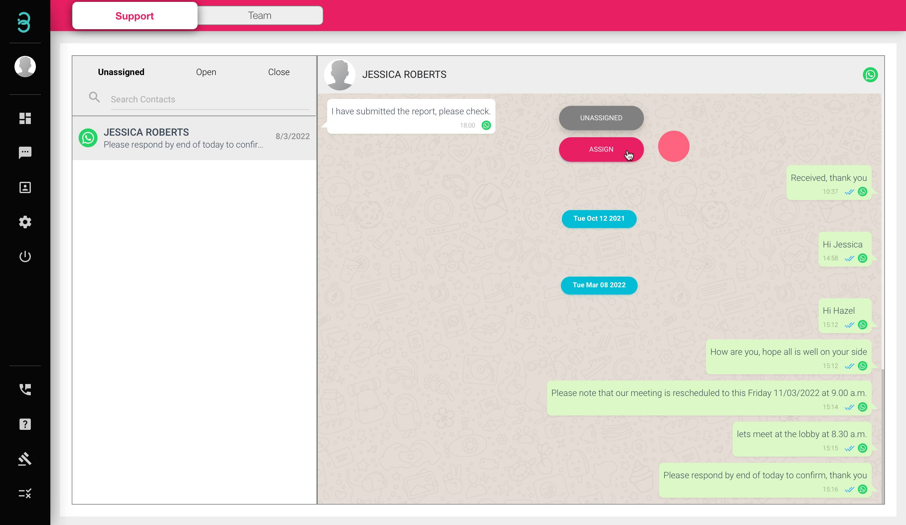
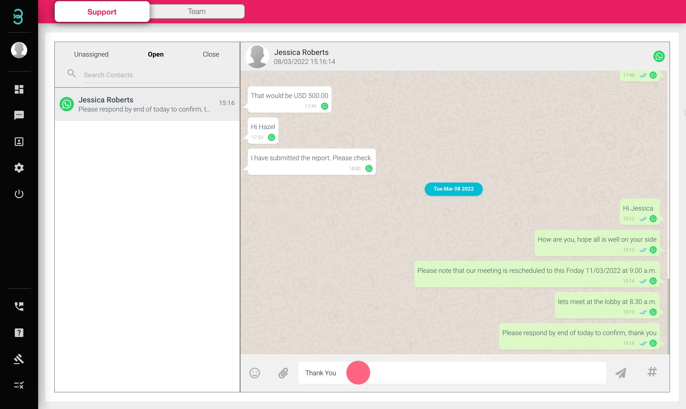
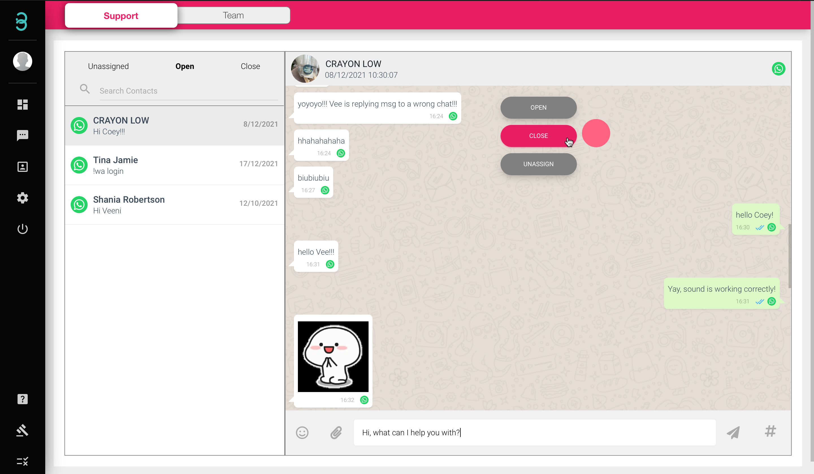

## How do I reply to new incoming messages and close them once I am done?

All new incoming messages are smartly segregated into a list in a single view. There will be 3 professional ticketing list

1. **Unassigned** - The “Unassigned” list is messages that are unattended by any of the team members.
2. **Open** - The “Open” list is where your team member will be replying to messages privately.
3. **Close** - Once a team member has successfully solved a customer’s inquiries, moved the message over to the “Close” list.

:::info Unassigned

The “Unassigned” list is messages that are unattended by any of the team members.

:::

Step 1: Select the message you wish to reply, hover and select the **ASSIGN** button. 

Start replying to your customers by sending text, emojis, attachments, and even a voice note to help them solve their queries.

:::info Open

The “Open” list is where your team member will be replying to messages privately.

:::

:::info Close

Once a team member has successfully solved a customer’s inquiries, moved the message over to the “Close” list.

:::

Step 2: Once all of your customer queries are resolved, hover and select the **CLOSE** button.

