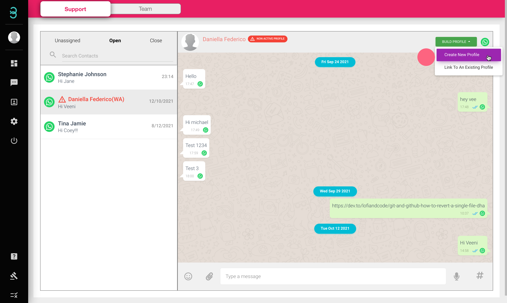
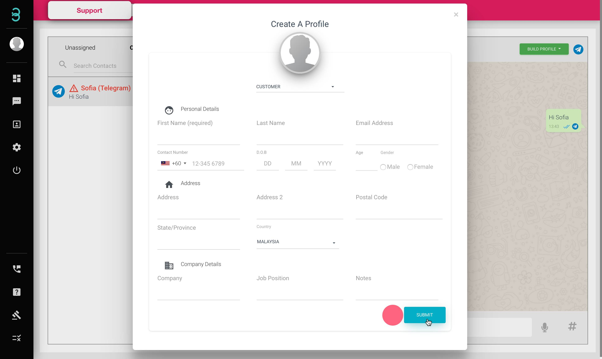
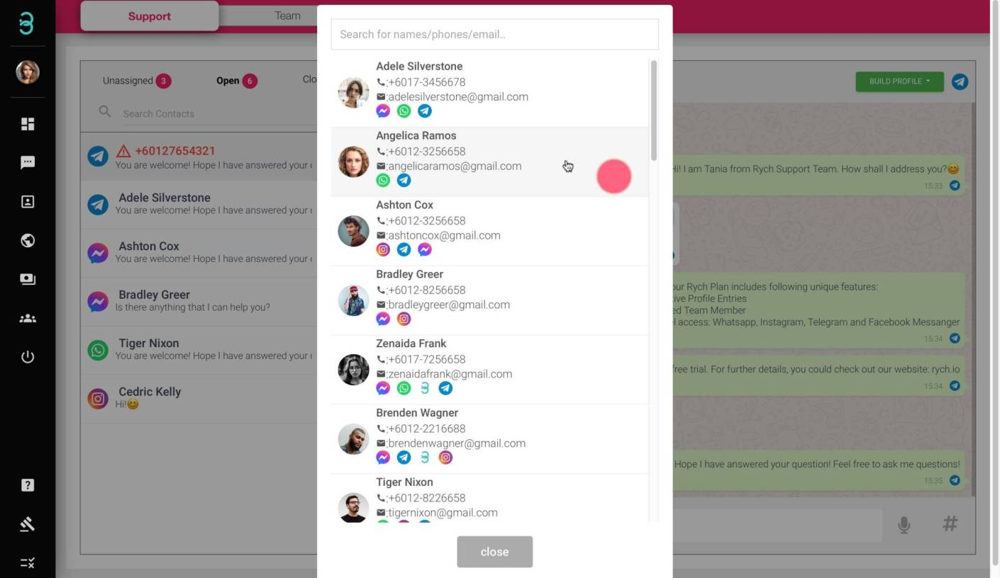

## How do I create an Active Profile inside the chat page?

Once an **Active Profile** is created, you have enabled features, automation & insights and will be able to view their history messages.
Any messages which are **non-Active Profiles** will be removed from the portal after 24 hours. 

:::tip Red Font

If a profile name appears in red with a hazard symbol, it means that the contact is a non-Active Profile in your database. An Active Profile in the database will appear in Black Font.

:::

Step 1: Select the **BUILD PROFILE** button to **Create New Profile** or **Link to An Existing Profile**.

Step 2: **Create New Profile** - Fill in all the required information about your customer. 

**Link to An Existing Profile** - Search & select your existing **Active Profile** to merge as a sub-profile. 

