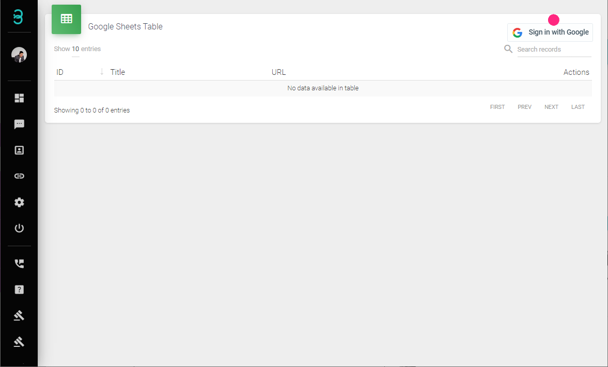
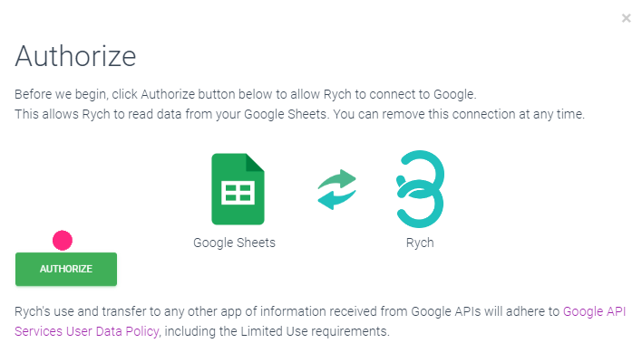
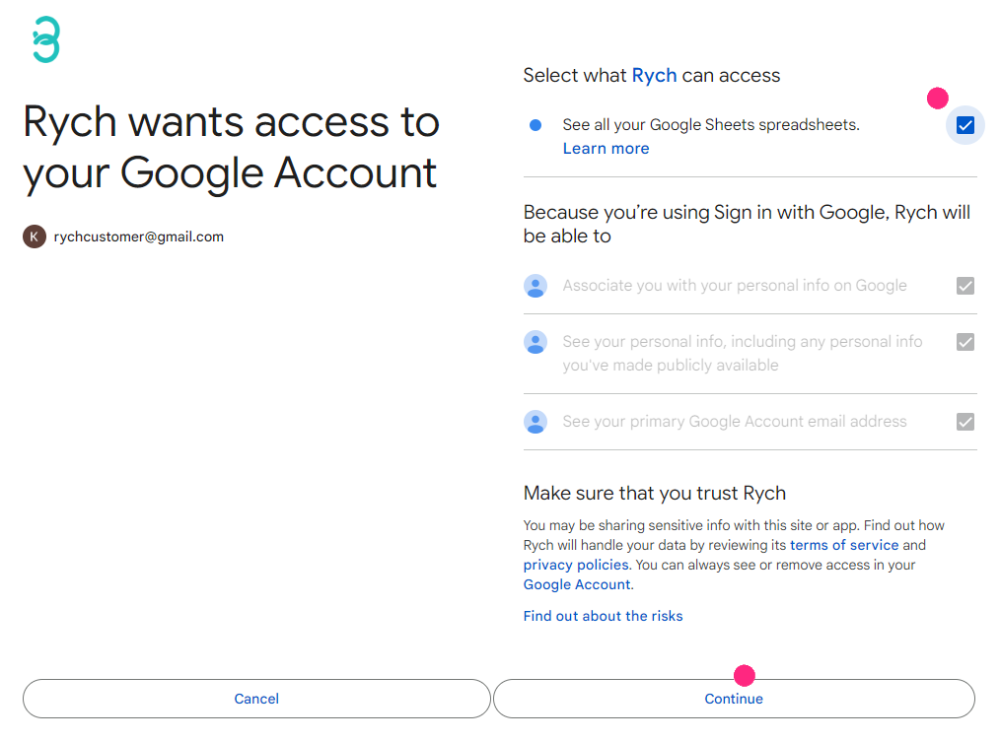

# How Do I Connect to Google Sheets?

Rych can read contents from preselected Google Sheets to automatically send a "Welcome Message" to new entries. This feature is commonly used in conjunction with Google Forms, where new entries in Google Forms are updated in Google Sheets, which Rych then picks up. This is particularly useful for events or presentations where customers fill in forms that include contact details.

:::info Name and Contact Details
Since Rych saves customer details into an Active Profile and automatically sends a welcome message, it is crucial that at least the first name and contact details are present.
:::

Step 1: Connect to Google Sheets

1. **Sign in with Google**:
   - Click on "Sign in with Google".

   

   - Click on "Authorize".

   

   - Select your Google Sheets account.

   

   - Click on "Continue".

   

   - Check the box for "See all your Google Sheets spreadsheets" and click on "Continue".

   
      
   On successful login, the status will display "Signed in as...".

   

Step 2: Select the Related Google Sheets Spreadsheet

1. **Open the New Google Sheets Wizard**:
   - Click on "+" to start the "Link Google Sheets" process.

   

2. **Link Google Sheets**:

    

   - **Spreadsheet Title**: A title for the selected spreadsheet.
   - **Spreadsheet URL**: The URL of the targeted Google Sheets. Refer to the next guide, **Creating a Google Sheet**, on how to acquire the URL.
   - **#Add Tags**: Add new tags to profiles created through this Google Sheet. These can be used in **Reapproach Broadcast** later.

   Once done, click Next.

3. **Profile Labelling**:
   - Label the individual columns with the correct data type. All new data generated from this spreadsheet will be saved as an Active Profile based on the data labels assigned (e.g., First Name, Contact Number, Email, Company Name, etc.). The minimum required data are the "First Name" and "Contact Number".

   

   Example labels:
   - Spreadsheet column "Name" as the "First Name" in Rych.
   - Spreadsheet column "Phone Number" as the "Contact Number" in Rych.
   - Spreadsheet column "Timestamp" set to "Ignore" as this data will not be saved in Active Profile.

    :::info Data Types
    You may link predefined spreadsheet columns to respective data types. If the data type is not available, select "Others" and enter a new title for the data type, which will be stored under "Remarks" in Active Profiles.
    :::
   
   Once done, click Next.

4. **Automation Message**:
   - Customize a welcome message. This welcome message will be sent through WhatsApp based on the retrieved spreadsheet data.

   

   - **Message Template**: Type out the designated message and personalize it by inserting data from the previously assigned profile labels.
   - **Message Preview**: Shows a preview of the designated message.

   Once done, click Finish.

**You have successfully linked the Google Sheets spreadsheet**

:::caution Important Notes
1. **Mobile Number Format**: Ensure there’s a "+" and country code included.
   - Example: +60xxxxxxxx (Malaysia), +65xxxxxxxx (Singapore), +62xxxxxxxxxx (Indonesia).
2. **Spam Reminder**: We do not encourage spam messages sent through our system.
3. **Terms of Service**: Accounts may be banned if we believe the account activity violates our [Terms of Service](https://rych.io/terms-of-service-rych).
:::

Click Finish to close the wizard.
