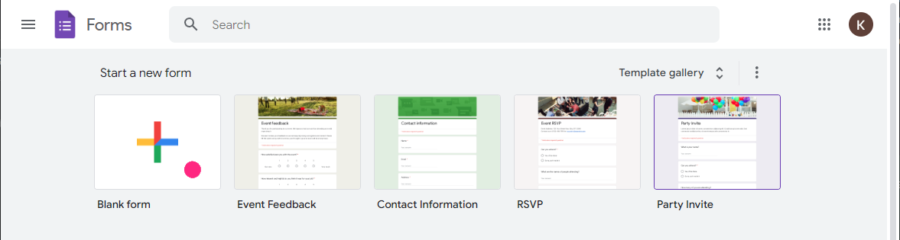
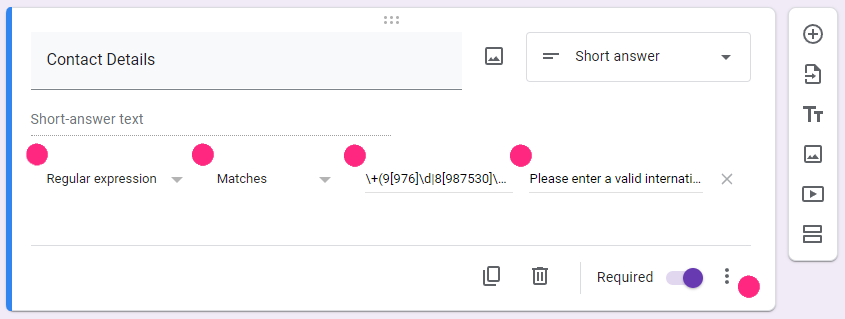
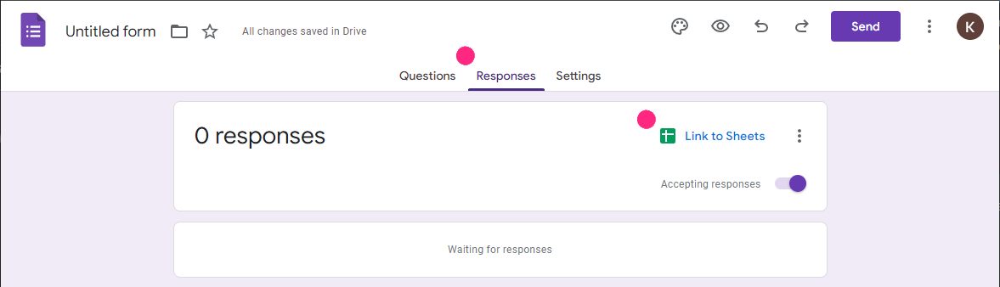

# Step-by-Step Guide: Creating a Google Form to Capture Customer Contact Details and Output to Google Sheets

Step 1: Create a Google Form

1. **Open Google Forms**: Go to [Google Forms](https://forms.google.com) and click on the `+` button to create a new form.

   

2. **Title and Description**:
   - Enter a title for your form, e.g., "Customer Contact Details - Roadshow".
   - Provide a description, e.g., "Please fill out your contact details so we can keep in touch."

   

3. **Add Questions**:
   - Click on the `Untitled Question` field to add a new question.
   - For the **Name** field:
     - Select the question type as `Short answer`.
     - Enter the question text, e.g., "Name".
     - Mark it as a required field by toggling the `Required` switch.

   

   - For the **Contact Details** field:
     - Select the question type as `Short answer`.
     - Enter the question text, e.g., "Contact Details (Phone)".
     - Mark it as a required field by toggling the `Required` switch.

   

   :::info Minimum Required Fields
    Rych requires a minimum of both "Name" and "Contact Details" field to work. You may continue the above steps to add more questions to further enhance the Active Profile data for better understanding of your customers.
    :::

4. **Optional: Set Validation for Contact Details**:
   - Click on the three dots (`⋮`) at the bottom-right corner of the Contact Details question.
   - Select `Response validation`.
   - In the response validation settings:
     - Choose `Regular expression` from the dropdown.
     - Select `Matches`.
     - Enter the regular expression:  
     `\+(9[976]\d|8[987530]\d|6[987]\d|5[90]\d|42\d|3[875]\d|2[98654321]\d|9[8543210]|8[6421]|6[6543210]|5[87654321]|4[987654310]|3[9643210]|2[70]|7|1)\d{1,14}`.
     - Provide a custom error message, e.g., "Please enter a valid international phone number".

   

Step 2: Link Google Form to Google Sheets

1. **Link to Sheets**:
   - Click on the `Responses` tab.
   - Click the green Sheets icon to create a new spreadsheet.

   

2. **Create Spreadsheet**:
   - Choose `Create a new spreadsheet` and name it appropriately, e.g., "Roadshow Customer Contacts".
   - Click `Create`.

   

Step 3: Access the Google Sheets URL

1. **Open Google Sheets**:
   - Once the form is linked to a new Google Sheets, the spreadsheet opens automatically.
   - The URL in your browser's address bar is the link to your Google Sheets spreadsheet.
   - Select the URL and copy the URL address

   

2. **Link Google Sheets to Rych**:

    During this stage of the Wizard, please paste the above copied URL in the **Spreadsheet URL** field.

    

   - **Spreadsheet URL**: The URL of the targeted Google Sheets. Refer to the next guide, **Creating a Google Sheet**, on how to acquire the URL.
   - You may refer to **Connecting Google Sheets** guide.

Conclusion

By following these steps, you have successfully created a Google Form to capture customer contact details (example for a roadshow event) and linked it to a Google Sheets spreadsheet. You can now collect responses and access them directly in Google Sheets.