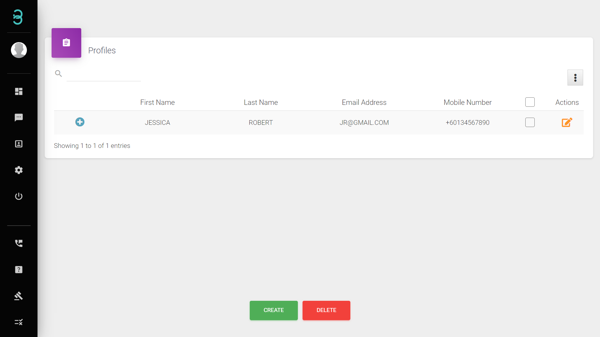
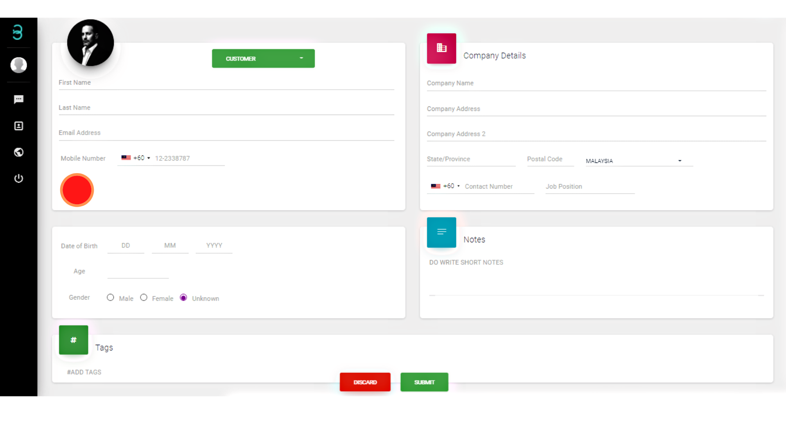
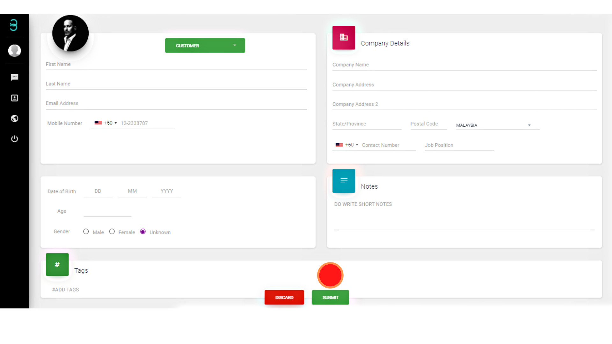
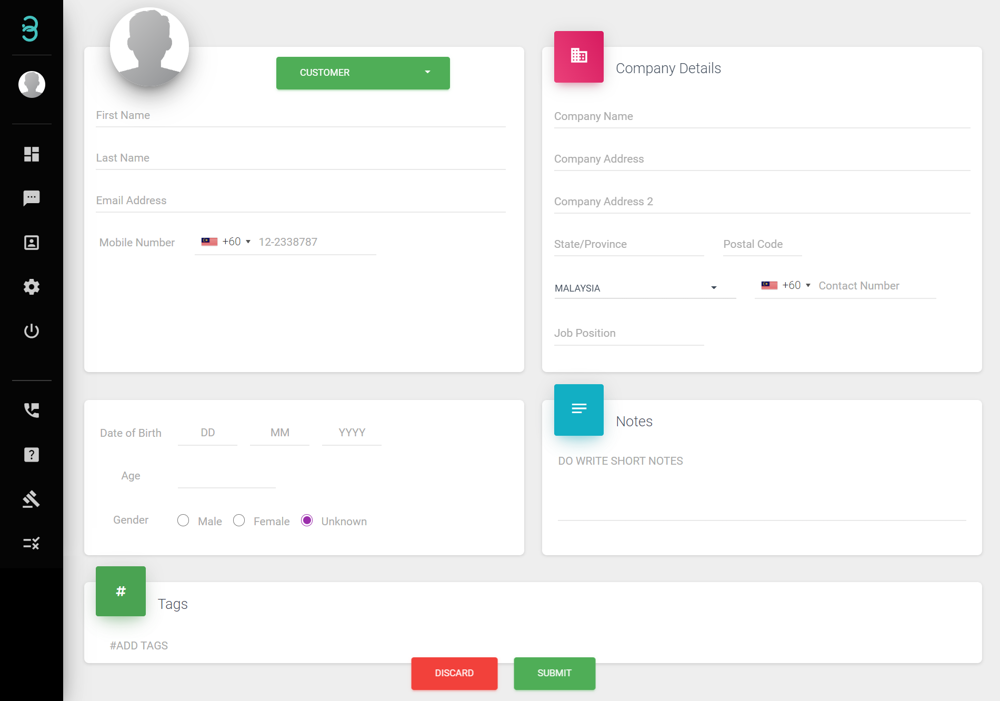

# I have my customer’s information, but how do I create a profile without request from the customer?

Step 1: On the Profiles page, click on the Create button at the bottom of the page.

Step 2: Click on the green button to categorise the profile as customer or vendor.

Step 3: Fill in the required information, add **tags*** or notes to categorise customers.

:::info Tags
Tags are hashtags (#) that you can tag on customer profiles which will help you categorise specific customers so you could easily search them.
:::

Step 4: Finally click on the **SUBMIT** button at the bottom of the page to successfully add your customer's profile into your database.

