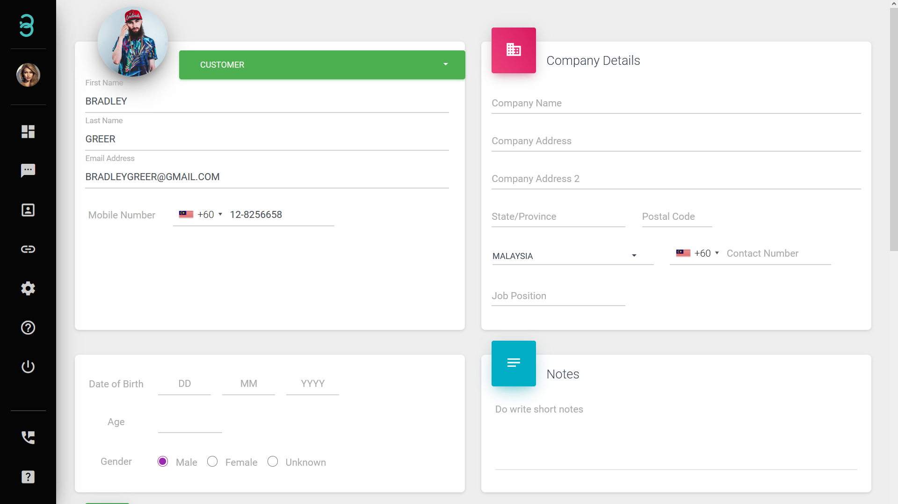

# Is it simple to manage all my Active Profiles?

It takes only 2 steps to manage your **Active Profiles**.

:::tip Search bar

The search bar allows you to filter customers based on the tags and notes as well as search for specific customers.

:::

Step 1: Type in a keyword to **search** for a specific profile. It can be First Name, Email, or even Tags. 

A list of results will be populated. To display more information select the **Kebab** icon (3 vertical dots). To expand, select the **+** icon.

:::info Update, Delete, or Export

Only users with admin roles will have full access.
:::

Step 2: Select the Active Profiles to **Update**, **Delete** or **Export**.

**Update** - Select the **Actions** icon to update the profile details. 

