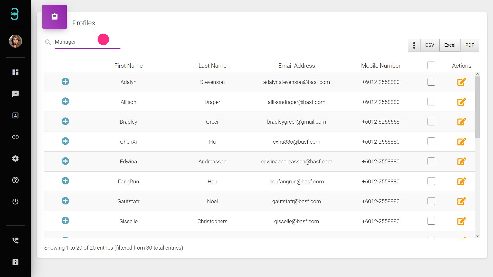

# I have many customer profiles, is it simple to manage all those profiles?

It takes only 3 steps to manage your customer profiles

Step 1: Type in a keyword in the **search******* bar to identify specific customers. Click the + symbol for summarised information dropdown.

:::tip Search bar

Search bar allows you to filter customers based on the tags and notes as well as search for specific customers
:::

Step 2: Export your customers database with a single click on **CSV, Excel or PDF button**.*****

:::info CSV,Excel or PDF button

Click on either CSV, Excel or PDF will export your customer profile database to your preferred format.
:::

Step 3: Clicking on the Action button would lead to a profile page where you can edit an existing customer’s profile.

It is as simple as that to manage customer profiles through Rych.
