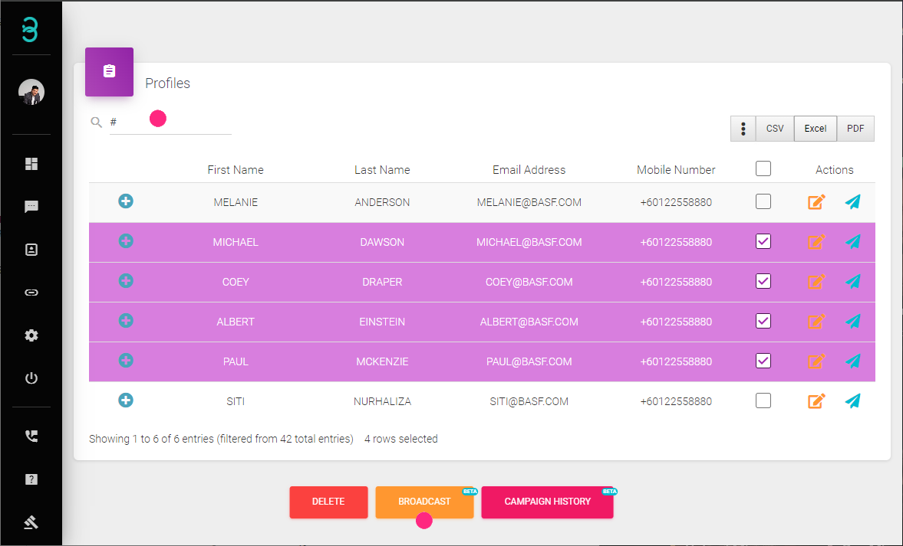
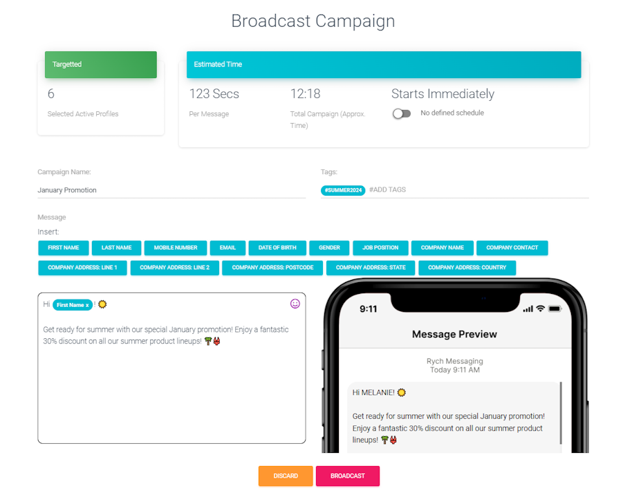

# How Do I Reapproach My Active Profiles?

With constant updates and changes, we can easily **reapproach active profiles** by broadcasting a personalized message to them.

:::tip Search Bar
The search bar allows you to filter customers based on tags and notes, as well as search for specific customers.
:::

Step 1: Search for and Select Targetted Profiles.

Type in a keyword to **search** for a specific profile. It can be a First Name, Email, or even Tags. 
A list of results will be populated. To display more information, select the **Kebab** icon (3 vertical dots).

Select the targeted Active Profiles for **Reapproach Broadcast**. Once done, click on the **Broadcast** button.

Step 2: Create a Broadcast Campaign.

Create a Broadcast Campaign with the following details:

- **Campaign Name**: A title for the broadcast campaign.
- **Tags (optional)**: Add new tags to the selected active profiles after the broadcast is complete.
- **Message**: Type out the designated message and personalize it by inserting data from the active profiles.
- **Message Preview**: Shows a preview of the designated message.

:::info Estimated Time
Based on the designated message, RYCH will estimate the duration needed to send a single message as well as the time needed to complete the whole campaign.
:::

Step 3 (Optional): Schedule the Campaign.

By default, the campaign will start immediately. Optionally, you can set a schedule by defining the date and time the campaign should start.

