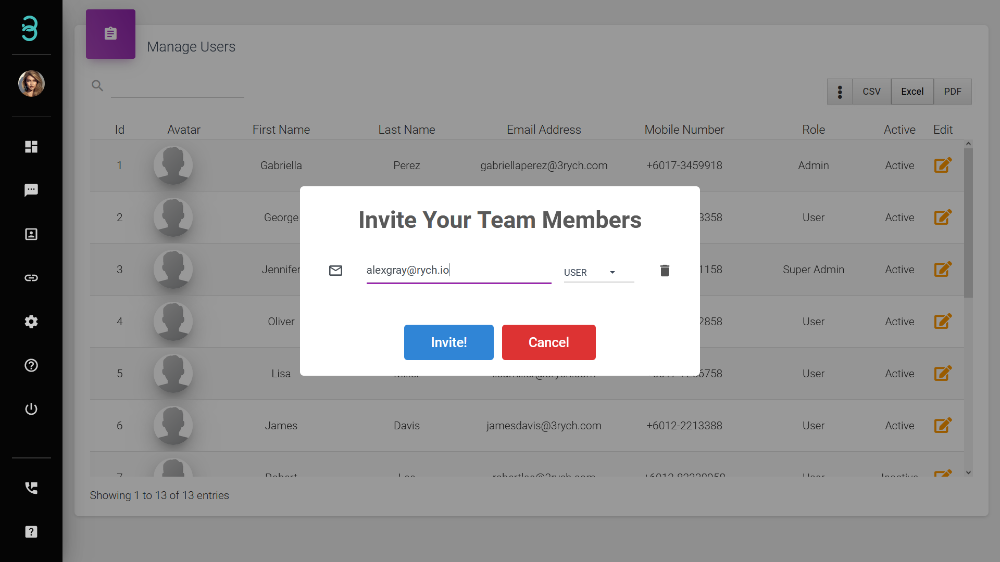

# How do I invite my team to be a part of my RYCH account user or admin?

Have your team of experts to chat with your customers.

Step 1: Click on **Invite Users** on the Manage User page to invite team members via email address.

Step 2: An email invitation will be sent, click on the **Activate Account** or paste the link provided into their browser.

Step 3: Complete the form and click **Finish**.

Now your team member is part of Rych assisting you with customers.
