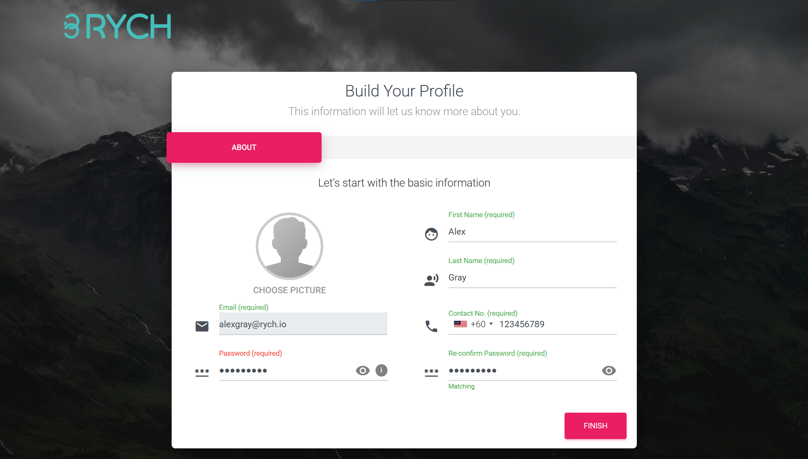

# How do I invite or remove my team with an admin or user role? 

Get your team of experts to give a better experience to your customers and at the same time build strong internal team collaboration. 

Step 1: At the menu sidebar, click on **Settings** and select **Manage Users**.

Invite team members via email address. You can invite unlimited team members, it’s counted as one (1) Active Profile for each team member.  

Step 2: An email will be sent to the invited user, select **Activate Account** or paste the link provided into their browser.

Step 3: Complete the information form. Now your team member is part of RYCH assisting you with customers.

You can remove or change the user role by selecting the **Edit** icon.

