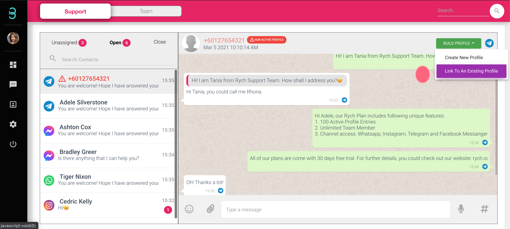
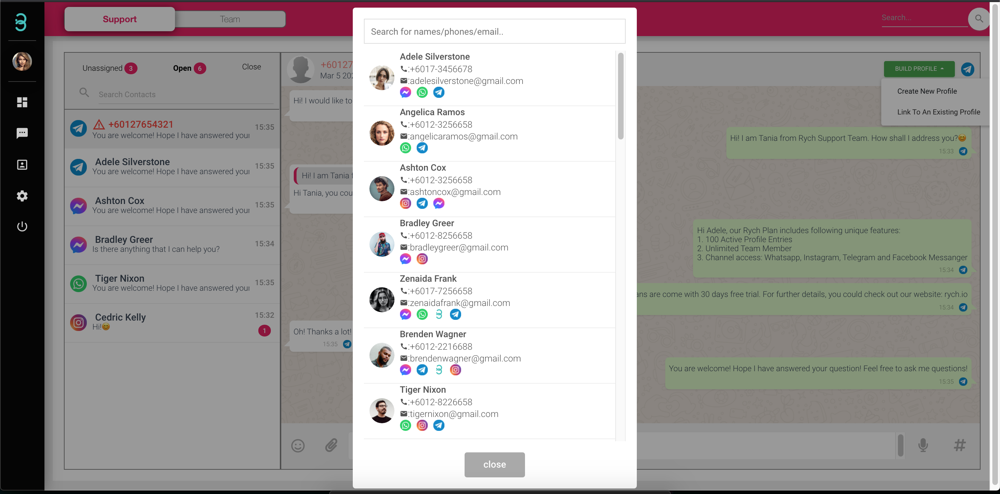
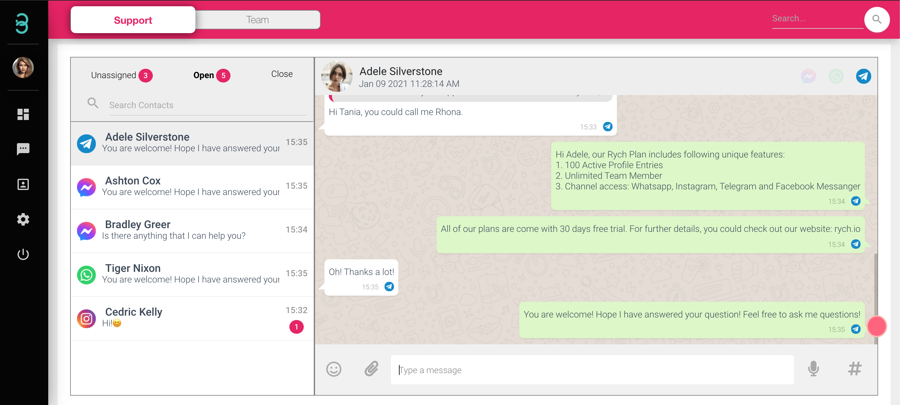

# How do I link my existing customer’s profile from a different channel under the same profile?

If you get a new message from an existing customer and it is from a different channel,link to an existing profile with these steps.

Step 1: Click that new **chat name (Red Font)** initiated by an existing customer and click on green **Build Profile** button where there will be an option **Link to An Existing Profile**

Step 2: Search for your customer’s profile and click on it. Now you will be able to chat with your customer from different channels in the same chat window.

Step 3: There will be an indication of the channel logo (example: Telegram) at the end of each dialogue. To chat, switch between channels via channel selection from top right.

Now you can chat with the same customer through different channels.
