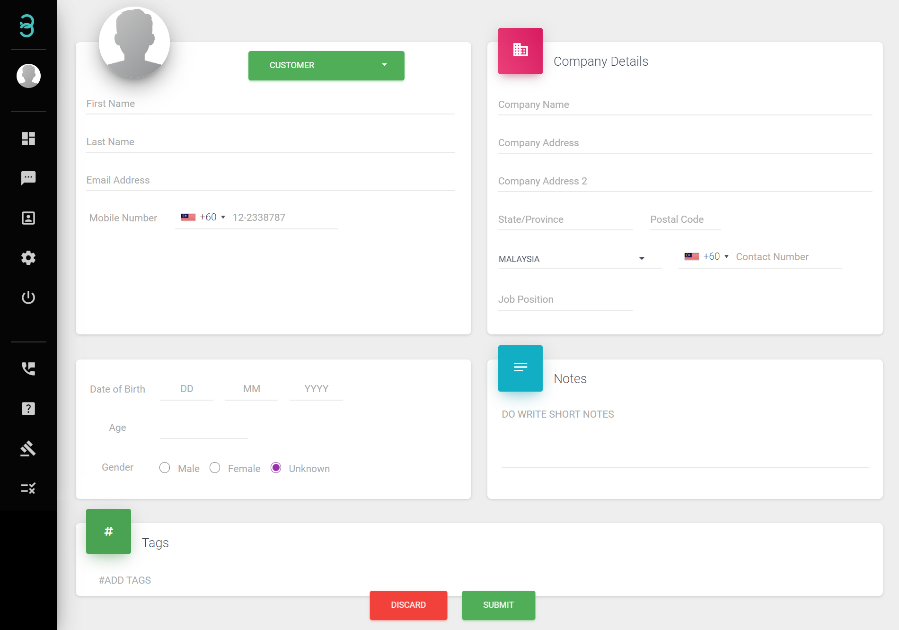

# I have my customer’s information, but how do I create a profile without request from the customer?

We have a tab specifically for profiles where you can manage existing or create new profiles. Follow this simple step to create a new profile for your customers to keep their database.

Step 1: Click on the green button to categorise the profile as customer or vendor.

Step 2: Fill in the required information,add tags or notes to categorise customers.

Step 3: Finally click on the Submit button at the bottom of the page to successfully add your customers profile into your database.

