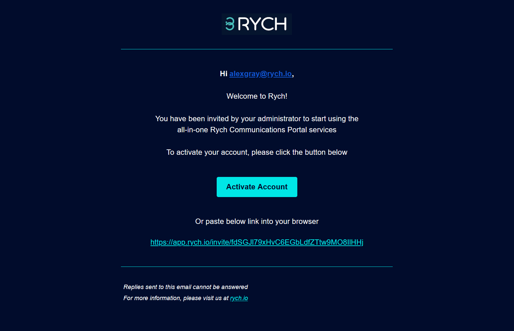

# How do I get started with RYCH and register as an admin?

Here are 3 simple steps to get you started  in Rych:

Step 1: Click on **REGISTER** and fill in your details in the **Build your Profile** window and click **NEXT**.

Step 2: Complete the **COMPANY Details**,fill in your Team’s Email Address to invite them and click **NEXT**.

Step 3: Check your email for an **OTP** number to key in the **OTP** number field and click **FINISH**. Rych Welcomes You on a new journey with us.
Simple as that and now you are a part of Rych and we look forward to assisting you on your journey with us.

