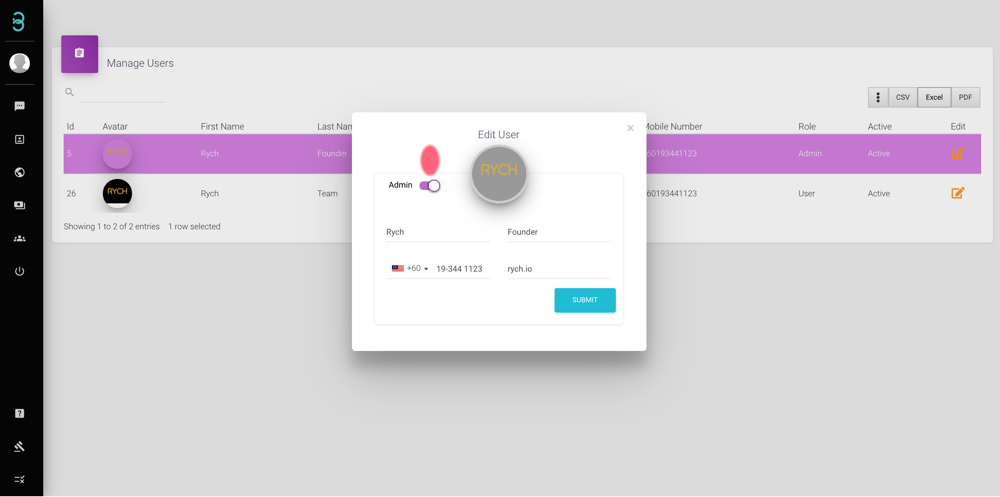
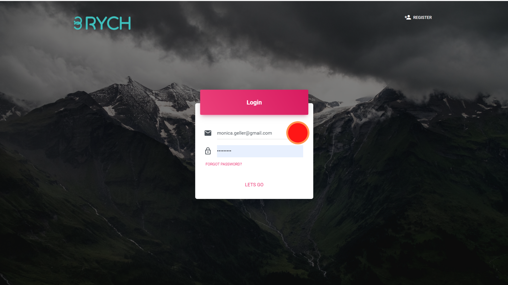

# How do I have my team register under my account?

The best part about Rych is that you can have your whole team operating at the same time.Here are the steps on First-Time Account Activation for Team Members.

Step 1: After receiving the invitation emails from Rych, click the Activate Account or click the link in the email to activate your account.

Step 2: Fill in all the required details and ensure that all of the password requirements are met.

Step 3: Login by using your registered email address and password to proceed.

Now you can have your team handle enquiry and messages from customers through RYCH.
