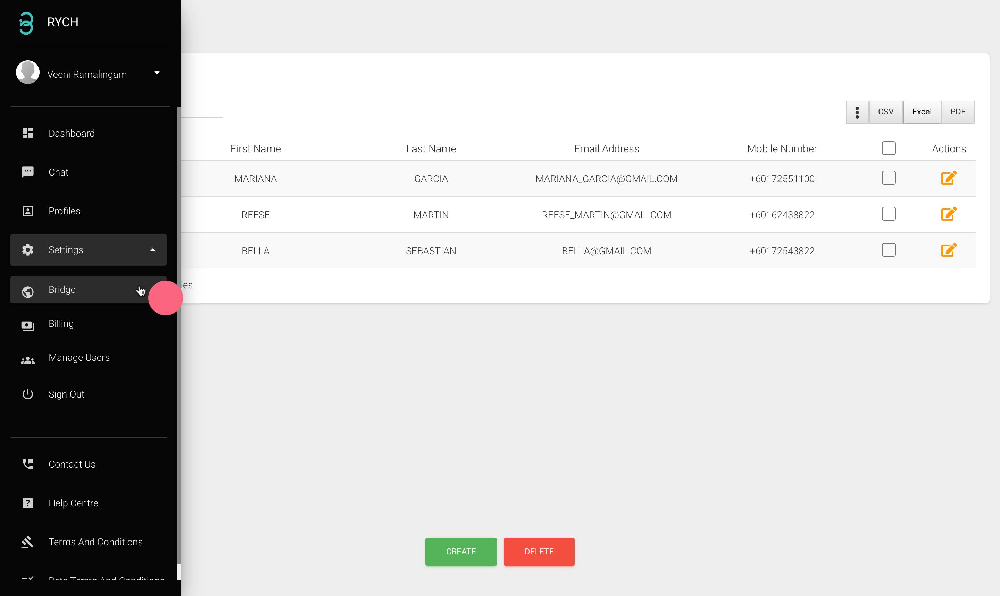
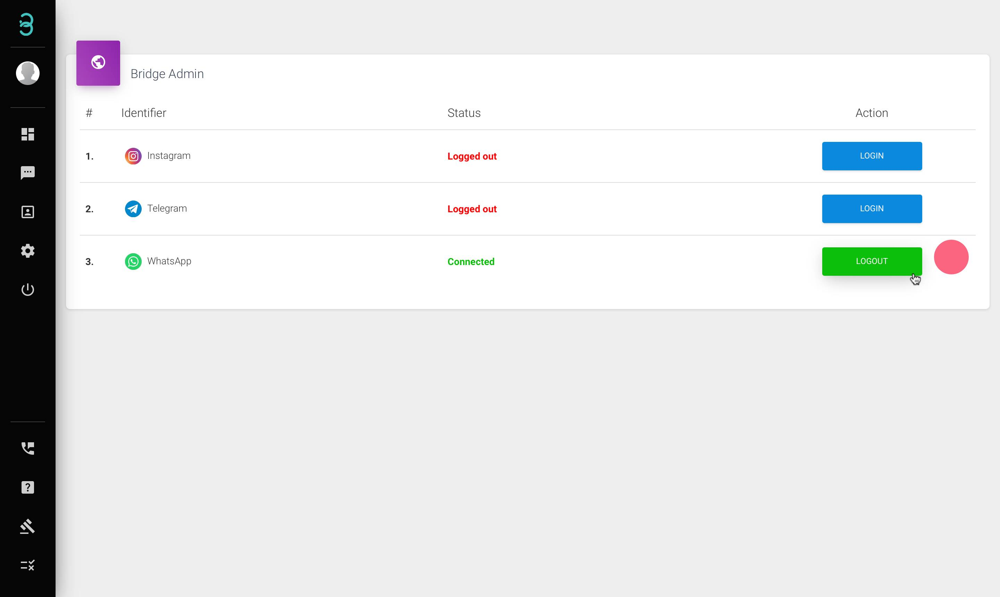

# Bagaimanakah saya boleh menyambungkan akaun Media Sosial saya ke akaun Rych saya?

Langkah 1: Klik pada perkataan **Bridge\*** pada bar menu.

:::info Bridge

"Bridging" ialah di mana anda menyambungkan akaun sosial anda ke akaun Rych anda. Cuma imbas kod QR yang akan muncul dalam skrin anda melalui aplikasi yang anda suka dan mula menghantar mesej kepada pelanggan anda melalui saluran itu.
:::

Langkah 2: Pilih saluran yang ingin anda "bridge" dan klik **Login**\*. 

:::caution Sila ambil perhatian :

Untuk "bridge" **Instagram**, anda mesti mematikan Pengesahan 2 Faktor (2FA) untuk dapat menyambungkan Instagram. Bagi **Whatsapp** pula, anda mesti menyertai **"Multi-device beta" sebelum mengimbas kod QR.**
:::

Langkah 3: Status "Connected" hijau akan dipaparkan pada skrin, menunjukkan bahawa penyambungan saluran anda berjaya.

:::caution Sila ambil perhatian :

Untuk "bridge" **Instagram**, anda mesti mematikan Pengesahan 2 Faktor (2FA) untuk dapat menyambungkan Instagram. Bagi **Whatsapp** pula, anda mesti menyertai **"Multi-device beta" sebelum mengimbas kod QR.**
:::
