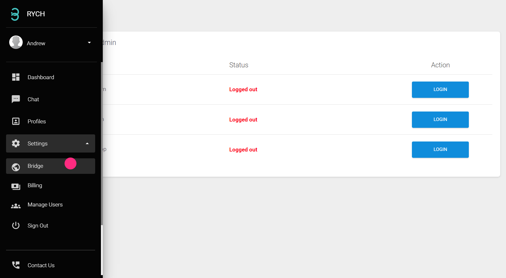
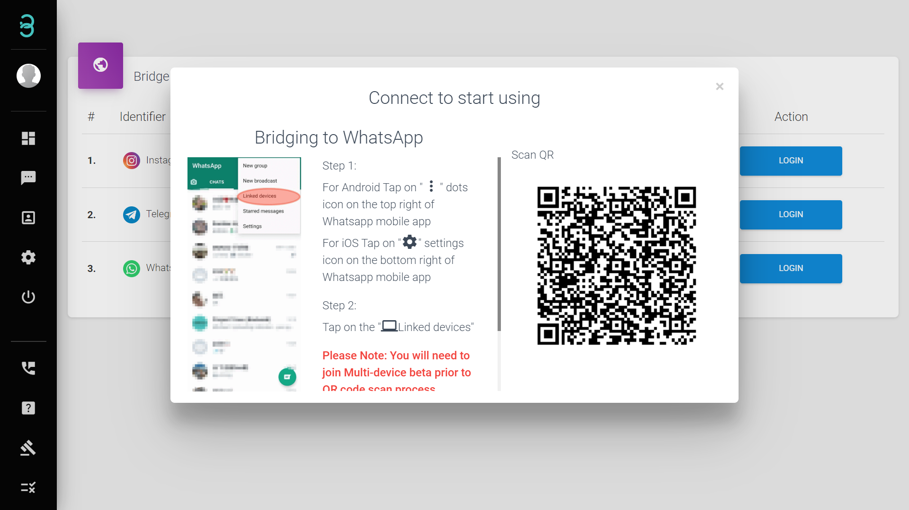
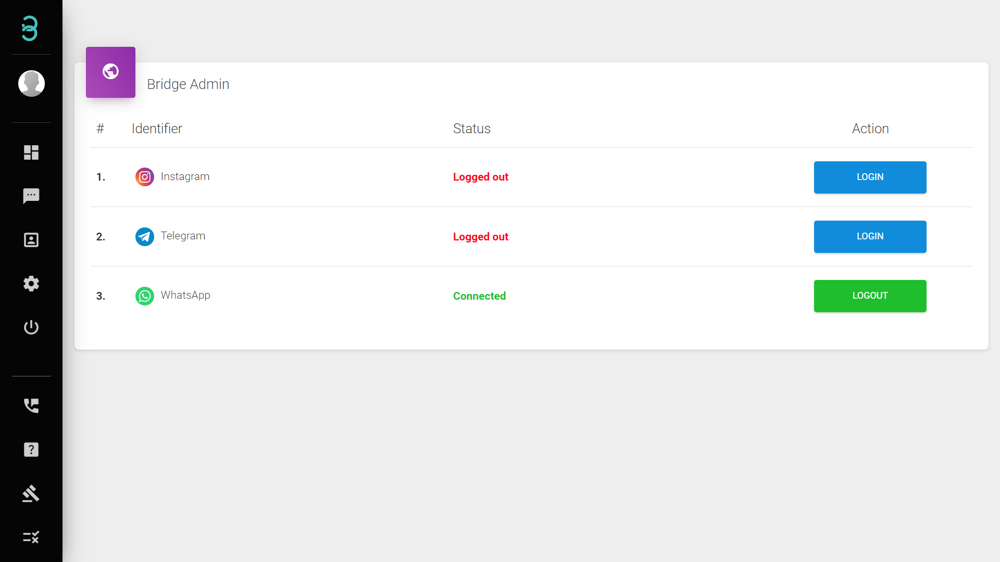

# Bagaimanakah saya boleh menyambung akaun saluran perniagaan saya?
 
:::info Bridge

Anda boleh menyambung akaun sosial dengan RYCH dalam halaman Bridge. Imbas kod QR atau log masuk dengan nama pengguna & kata laluan dan mula menghantar mesej kepada pelanggan anda.

:::

Langkah 1: Pada bar sisi menu, klik pada **Settings** dan pilih **Bridge**.

Langkah 2: Pilih akaun saluran yang anda ingin hubungkan.

:::caution Sila Ambil Perhatian :

 Untuk menyambung **Instagram**, anda perlu mematikan Pengesahan 2 Faktor (2FA) dalam tetapan aplikasi Instagram anda.

:::

Status **Connected** hijau menunjukkan saluran telah berjaya disambung.

