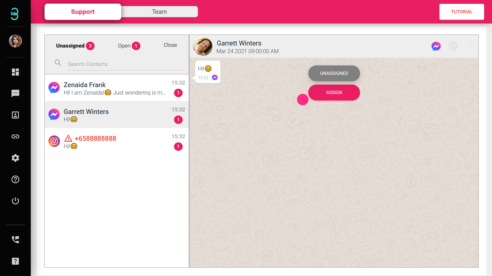
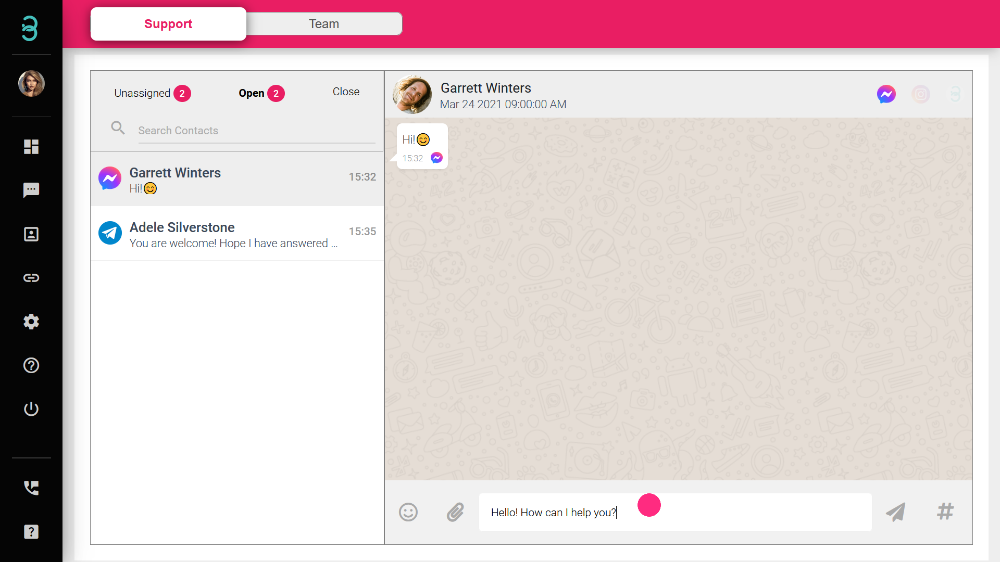

# Bagaimanakah cara untuk saya membalas mesej masuk baharu dan menutupnya sebaik sahaja saya selesai?

Semua mesej masuk baharu diasingkan secara automatik ke dalam senarai dalam satu paparan. Akan ada 3 senarai tiket profesional.

1. **Unassigned** - Senarai "Unassigned" memaparkan mesej yang masih belum dilayan oleh mana-mana ahli pasukan.
2. **Open** - Senarai "Open" ialah di mana ahli pasukan anda akan membalas mesej secara peribadi.
3. **Close** - Setelah ahli pasukan berjaya menyelesaikan pertanyaan pelanggan, alihkan mesej tersebut ke senarai "Close".

:::info Unassigned

Senarai "Unassigned" ialah mesej yang masih belum dilayan oleh mana-mana ahli pasukan.

:::

Langkah 1: Pilih mesej, tuding ke bahagian bualan dan pilih butang **ASSIGN**. 

Mula melibatkan diri dengan pelanggan anda dengan menghantar teks, emoji, lampiran dan juga nota suara untuk memberi pengalaman pelanggan yang baik. 

:::info Open

Senarai "Open" ialah tempat ahli pasukan anda akan membalas mesej secara tertutup. Pentadbir akan dapat melihat dan membalas mesej yang sama. 

:::

:::info Close

Setelah ahli pasukan berjaya menyelesaikan pertanyaan pelanggan, alihkan mesej itu ke senarai "Close".

:::

Langkah 2: Apabila anda telah membuatkan pelanggan berasa gembira dan berpuas hati, tuding pada bahagian bualan dan pilih butang **CLOSE**.

