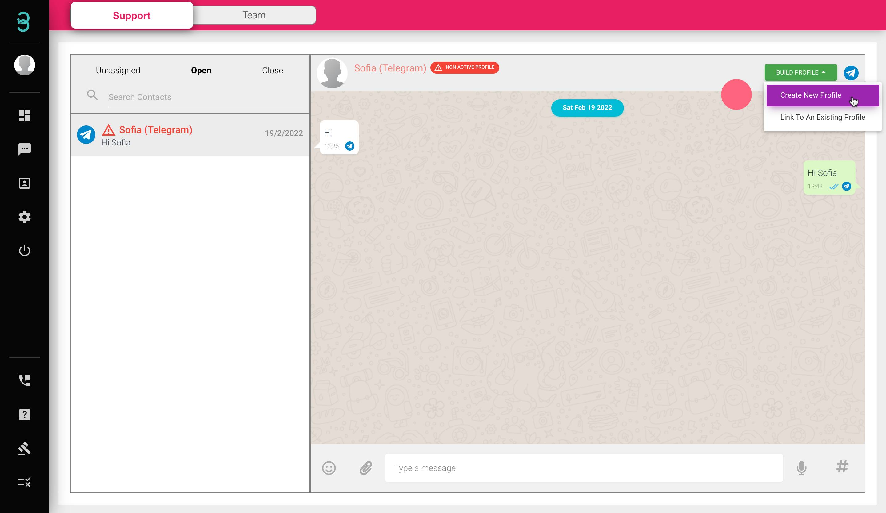
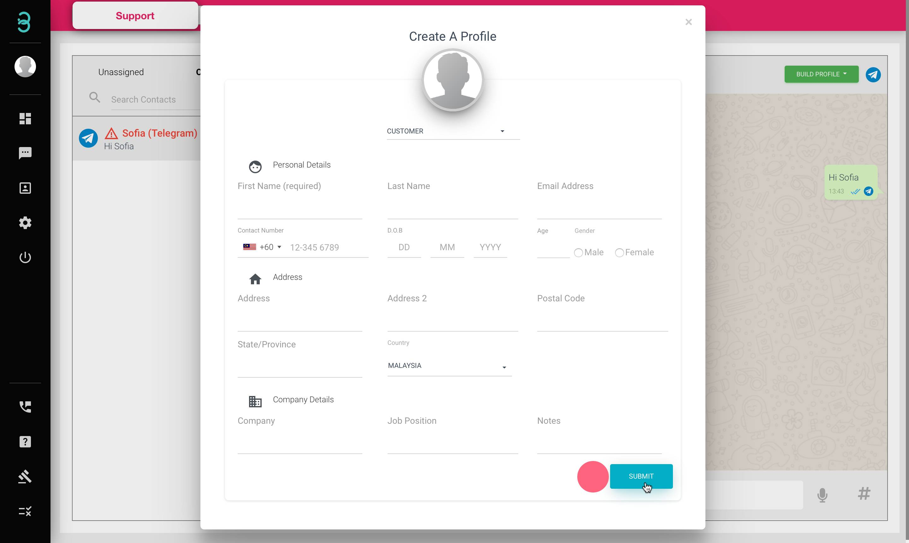

# Bagaimanakah cara saya menambah profil pelanggan ke dalam pangkalan data saya melalui halaman "chat"?

Jangan terlepas bakal pelanggan masa depan.
Hanya tambah profil mereka semasa anda bersembang dengan mereka dengan langkah-langkah ini.

Langkah 1: Klik pada kotak sembang pelanggan dengan **tulisan merah*** dan klik pada butang  hijau **BUILD PROFILE** dan klik pada Create New Profile.

:::tip Tulisan merah

Jika nama pelanggan muncul dalam warna merah dengan logo 'bahaya' ini bermakna kenalan itu tidak mempunyai profil dalam pangkalan data anda. Sebaik sahaja anda menambah kenalan dalam pangkalan data profil anda, nama kenalan akan menjadi Hitam.
:::

Langkah 2: Isikan semua maklumat pelanggan anda dan klik pada butang **biru Submit**.

Langkah 3: Setelah profil dibuat, nama pelanggan anda akan muncul dalam warna teks hitam.

