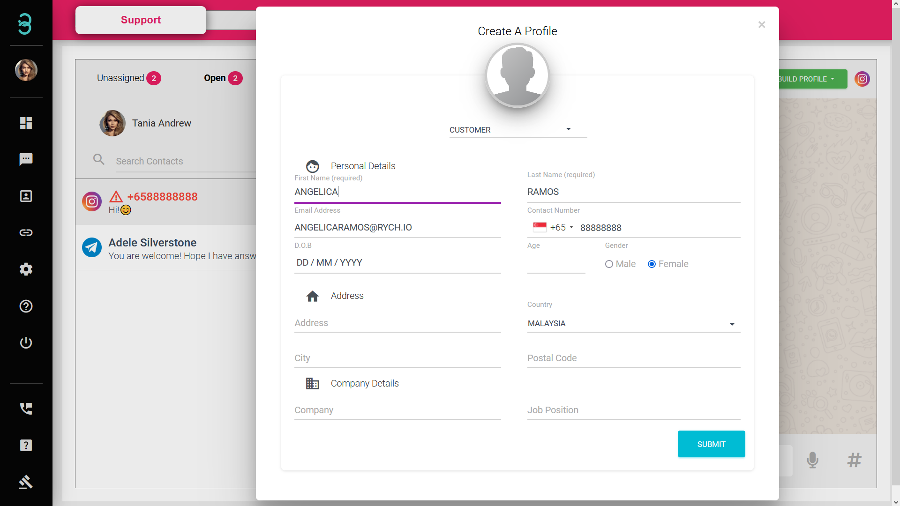
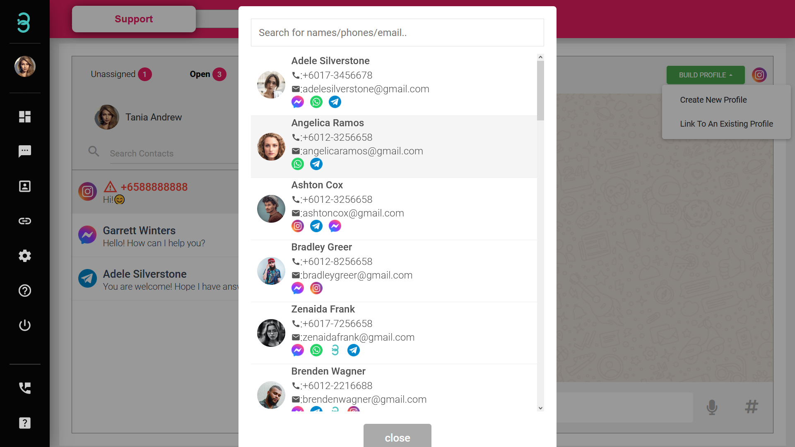

# Bagaimanakah cara saya mencipta atau memautkan 'Active Profile' di dalam halaman sembang?

Setelah **'Active Profile'** dicipta, anda telah mendayakan ciri, automasi & cerapan dan akan dapat melihat sejarah mesej profil tersebut.
Sebarang mesej yang merupakan **bukan 'Active Profile'** akan dialih keluar daripada portal selepas 24 jam. 

:::tip Red Font

Jika nama profil muncul dalam warna merah dengan simbol bahaya, ia bukan 'Active Profile' dalam pangkalan data anda. 'Active Profile' dalam pangkalan data akan muncul dalam Fon Hitam.

:::

Langkah 1: Pilih butang **BUILD PROFILE** kemudian pilih **Create New Profile** atau **Link to An Existing Profile**. Ini hanya dilakukan dalam senarai **Open**. 

Langkah 2: **Create New Profile** - Isikan semua maklumat yang diperlukan tentang pelanggan anda. Lebih banyak anda tahu, lebih baik pengalaman pelanggan yang boleh anda bina.  

**Link to An Existing Profile** - cari & pilih **Active Profile** sedia ada anda dan gabungkannya sebagai subprofil. Kini mesej daripada berbilang saluran akan ditunjukkan dalam satu paparan.  

