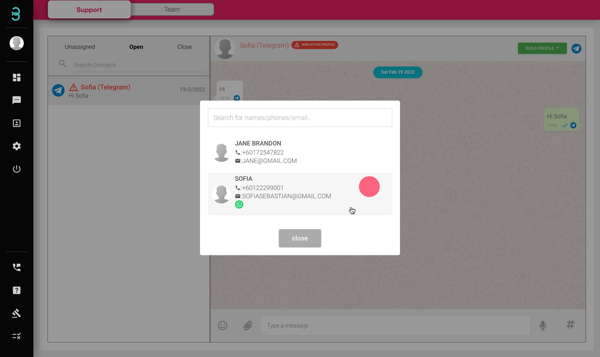

# Bagaimanakah cara saya memautkan profil pelanggan sedia ada saya daripada saluran lain di bawah profil yang sama?

Jika anda mendapat mesej baharu daripada pelanggan sedia ada dan ia daripada saluran lain, pautkan ke profil sedia ada dengan langkah ini.

Langkah 1: Klik pada **nama chat (Tulisan Merah)*** dimulakan oleh pelanggan sedia ada dan klik pada butang hijau **Build Profile** di mana akan terdapat pilihan "Link To An Existing Profile".

:::tip Tulisan merah

Jika nama pelanggan muncul dalam warna merah dengan logo 'bahaya' ini bermakna kenalan itu tidak mempunyai profil dalam pangkalan data anda. Sebaik sahaja anda menambah kenalan dalam pangkalan data profil anda, nama kenalan akan menjadi Hitam.
:::

Langkah 2: Cari profil pelanggan anda dan klik padanya. Kini anda akan dapat bersembang dengan pelanggan anda daripada saluran yang berbeza dalam tetingkap sembang yang sama.

Langkah 3: Akan ada logo saluran pada penghujung setiap dialog (dalam contoh ini, WhatsApp).

