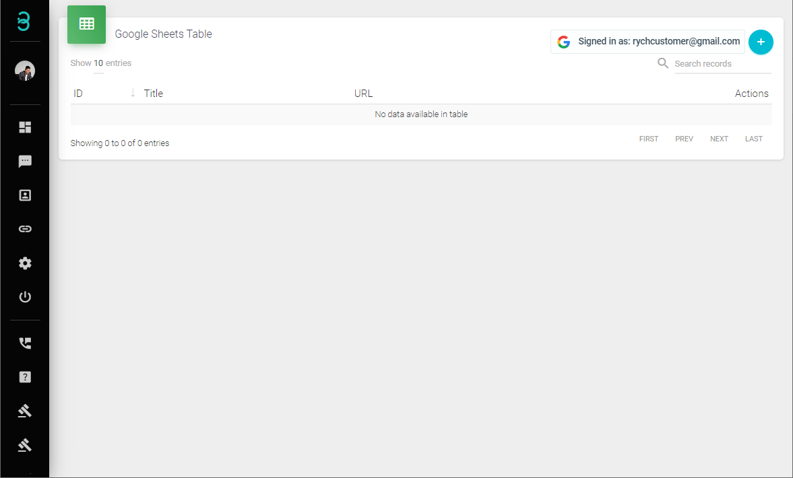

# Bagaimana Saya Boleh Menghubungkan ke Google Sheets?

Rych boleh membaca kandungan dari Google Sheets yang dipilih sebelumnya untuk menghantar "Mesej Selamat Datang" secara automatik kepada entri baru. Ciri ini biasanya digunakan bersama dengan Google Forms, di mana entri baru dalam Google Forms dikemas kini dalam Google Sheets, yang kemudian diambil oleh Rych. Ini adalah berguna terutamanya untuk acara atau persembahan di mana pelanggan mengisi borang yang termasuk butiran hubungan.

:::info Nama dan Butiran Hubungan
Memandangkan Rych menyimpan butiran pelanggan ke dalam Profil Aktif dan menghantar mesej selamat datang secara automatik, adalah penting bahawa sekurang-kurangnya nama pertama dan butiran hubungan adalah ada.
:::

Langkah 1: Menghubungkan ke Google Sheets

1. **Log masuk dengan Google**:
   - Klik pada "Log masuk dengan Google".

   

   - Klik pada "Benarkan".

   

   - Pilih akaun Google Sheets anda.

   

   - Klik pada "Teruskan".

   

   - Semak kotak untuk "Lihat semua lembar kerja Google Sheets anda" dan klik pada "Teruskan".

   
      
   Pada log masuk yang berjaya, status akan dipaparkan sebagai "Dilog masuk sebagai...".

   

Langkah 2: Pilih Lembar Kerja Google Sheets Berkaitan

1. **Buka Penyihir Lembar Kerja Google Sheets yang Baru**:
   - Klik pada "+" untuk memulakan proses "Pautan Google Sheets".

   

2. **Pautan Google Sheets**:

    

   - **Tajuk Lembar Kerja**: Tajuk untuk lembar kerja yang dipilih.
   - **URL Lembar Kerja**: URL Google Sheets yang dituju. Rujuk panduan seterusnya, **Mencipta Google Sheet**, untuk mendapatkan URL.
   - **#Tambah Teg**: Tambah teg baru ke dalam profil yang dicipta melalui Google Sheet ini. Ini boleh digunakan dalam **Hantaran Semula Pelbagai** kemudian.

   Setelah selesai, klik Seterusnya.

3. **Penamaan Profil**:
   - Namakan lajur individu dengan jenis data yang betul. Semua data baru yang dihasilkan dari lembar kerja ini akan disimpan sebagai Profil Aktif berdasarkan label data yang diberikan (contohnya, Nama Pertama, Nombor Hubungan, Emel, Nama Syarikat, dan lain-lain). Data minimum yang diperlukan adalah "Nama Pertama" dan "Nombor Hubungan".

   

   Contoh label:
   - Lajur lembar kerja "Nama" sebagai "Nama Pertama" dalam Rych.
   - Lajur lembar kerja "Nombor Telefon" sebagai "Nombor Hubungan" dalam Rych.
   - Lajur lembar kerja "Timestamp" ditetapkan kepada "Abaikan" kerana data ini tidak akan disimpan dalam Profil Aktif.

    :::info Jenis Data
    Anda boleh memautkan lajur-lajur lembar kerja yang telah ditetapkan sebelumnya kepada jenis data yang bersesuaian. Jika jenis data tidak tersedia, pilih "Lain-lain" dan masukkan tajuk baru untuk jenis data tersebut, yang akan disimpan di bawah "Ulasan" dalam Profil Aktif.
    :::
   
   Setelah selesai, klik Seterusnya.

4. **Mesej Automasi**:
   - Sesuaikan mesej selamat datang. Mesej selamat datang ini akan dihantar melalui WhatsApp berdasarkan data lembar kerja yang diperoleh.

   

   - **Templat Mesej**: Taip mesej yang ditetapkan dan peribadikan dengan memasukkan data dari label profil yang telah ditetapkan sebelum ini.
   - **Pratonton Mesej**: Menunjukkan pratonton mesej yang ditetapkan.

   Setelah selesai, klik Siap.

**Anda telah berjaya memautkan lembar kerja Google Sheets**

:::caution Nota Penting
1. **Format Nombor Telefon Bimbit**: Pastikan terdapat tanda "+" dan kod negara disertakan.
   - Contoh: +60xxxxxxxx (Malaysia), +65xxxxxxxx (Singapura), +62xxxxxxxxxx (Indonesia).
2. **Peringatan Spam**: Kami tidak menggalakkan mesej spam yang dihantar melalui sistem kami.
3. **Terma Perkhidmatan**: Akaun mungkin dilarang jika kami percaya aktiviti akaun melanggar [Terma Perkhidmatan](https://rych.io/terms-of-service-rych) kami.
:::

Klik Siap untuk menutup penyihir.
