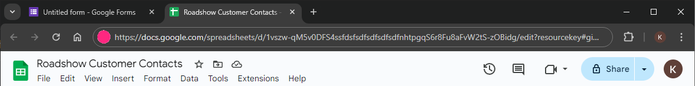

# Panduan Langkah demi Langkah: Mencipta Google Form untuk Menangkap Butiran Hubungan Pelanggan dan Output ke Google Sheets

Langkah 1: Cipta Google Form

1. **Buka Google Forms**: Pergi ke [Google Forms](https://forms.google.com) dan klik butang `+` untuk mencipta borang baru.

   

2. **Tajuk dan Penerangan**:
   - Masukkan tajuk untuk borang anda, contohnya, "Butiran Hubungan Pelanggan - Roadshow".
   - Berikan penerangan, contohnya, "Sila isi butiran hubungan anda supaya kami dapat berhubung".

   

3. **Tambah Soalan**:
   - Klik pada medan `Soalan Tanpa Tajuk` untuk tambah soalan baru.
   - Untuk medan **Nama**:
     - Pilih jenis soalan sebagai `Jawapan Pendek`.
     - Masukkan teks soalan, contohnya, "Nama".
     - Tandakan sebagai medan wajib dengan memilih `Diperlukan`.

   

   - Untuk medan **Butiran Hubungan**:
     - Pilih jenis soalan sebagai `Jawapan Pendek`.
     - Masukkan teks soalan, contohnya, "Butiran Hubungan (Telefon)".
     - Tandakan sebagai medan wajib dengan memilih `Diperlukan`.

   

   :::info Medan Wajib Minimum
    Rych memerlukan sekurang-kurangnya medan "Nama" dan "Butiran Hubungan" untuk berfungsi. Anda boleh teruskan langkah di atas untuk tambah soalan lebih untuk meningkatkan data Profil Aktif untuk pemahaman yang lebih baik tentang pelanggan anda.
    :::

4. **Pilihan: Tetapkan Pengesahan untuk Butiran Hubungan**:
   - Klik pada tiga titik (`⋮`) di sudut kanan bawah soalan Butiran Hubungan.
   - Pilih `Pengesahan respons`.
   - Dalam tetapan pengesahan respons:
     - Pilih `Ekspresi biasa` dari dropdown.
     - Pilih `Padanan`.
     - Masukkan ekspresi biasa:  
     `\+(9[976]\d|8[987530]\d|6[987]\d|5[90]\d|42\d|3[875]\d|2[98654321]\d|9[8543210]|8[6421]|6[6543210]|5[87654321]|4[987654310]|3[9643210]|2[70]|7|1)\d{1,14}`.
     - Berikan mesej ralat kustom, contohnya, "Sila masukkan nombor telefon antarabangsa yang sah".

   

Langkah 2: Sambung Google Form ke Google Sheets

1. **Pautan ke Sheets**:
   - Klik pada tab `Tanggapan`.
   - Klik ikon Lembar Google hijau untuk mencipta lembar kerja baru.

   

2. **Cipta Lembar Kerja**:
   - Pilih `Cipta lembar kerja baru` dan berikan nama yang sesuai, contohnya, "Butiran Hubungan Pelanggan Roadshow".
   - Klik `Cipta`.

   

Langkah 3: Akses URL Google Sheets

1. **Buka Google Sheets**:
   - Setelah borang dipautkan ke Lembar Google baru, lembar kerja akan dibuka secara automatik.
   - URL dalam bar alamat pelayar anda adalah pautan ke lembar kerja Google Sheets anda.
   - Pilih URL dan salin alamat URL

   

2. **Pautkan Google Sheets ke Rych**:

    Pada peringkat ini Wizard, sila tampal URL yang disalin di atas dalam medan **URL Lembar Kerja**.

    

   - **URL Lembar Kerja**: URL Lembar Google yang dituju. Rujuk kepada panduan seterusnya, **Mencipta Lembar Google**, untuk mengetahui cara mendapatkan URL.
   - Anda boleh merujuk kepada panduan **Menyambung Lembar Google**.

Kesimpulan

Dengan mengikuti langkah-langkah ini, anda telah berjaya mencipta Google Form untuk menangkap butiran hubungan pelanggan (contoh untuk acara roadshow) dan memautkannya ke lembar kerja Google Sheets. Anda kini boleh mengumpul tanggapan dan mengaksesnya secara langsung di Google Sheets.
