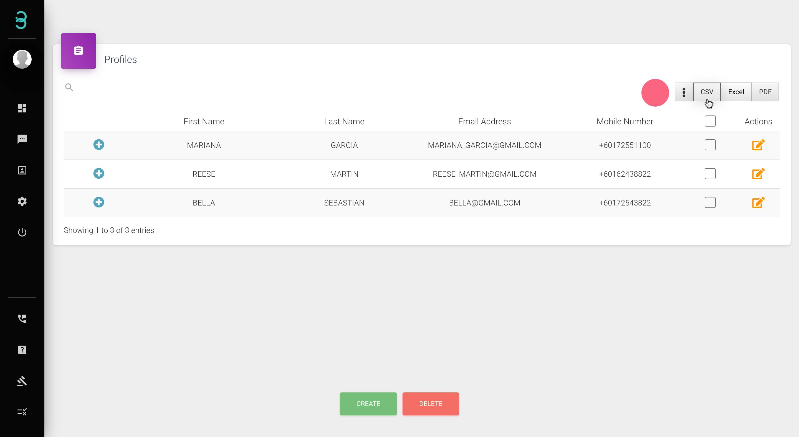
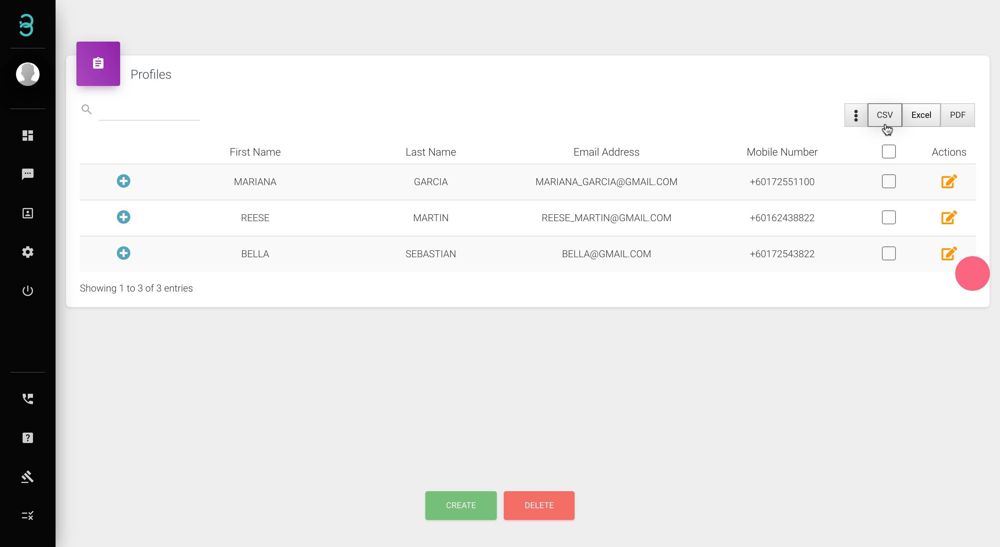

# Saya mempunyai banyak profil pelanggan, adakah mudah untuk mengurus semua profil tersebut?

Hanya 3 langkah untuk mengurus profil pelanggan anda.

Langkah 1: Taipkan kata kunci dalam kotak **search******* untuk mengenal pasti pelanggan tertentu. Klik simbol + untuk melihat informasi "dropdown" yang diringkaskan.

:::tip Kotak Carian

Kotak carian membolehkan anda menapis pelanggan berdasarkan tags dan nota serta mencari pelanggan tertentu.
:::

Langkah 2: Eksport pangkalan data pelanggan anda dengan satu klik pada **CSV, Excel or PDF button**.*****

:::info Butang CSV,Excel atau PDF

Klik pada CSV, Excel atau PDF untuk mengeksport pangkalan data profil pelanggan anda ke format pilihan anda.
:::

Langkah 3: Klik pada butang Action akan membawa ke halaman profil di mana anda boleh mengedit profil pelanggan sedia ada.

Semudah itu untuk menguruskan profil pelanggan melalui Rych.
