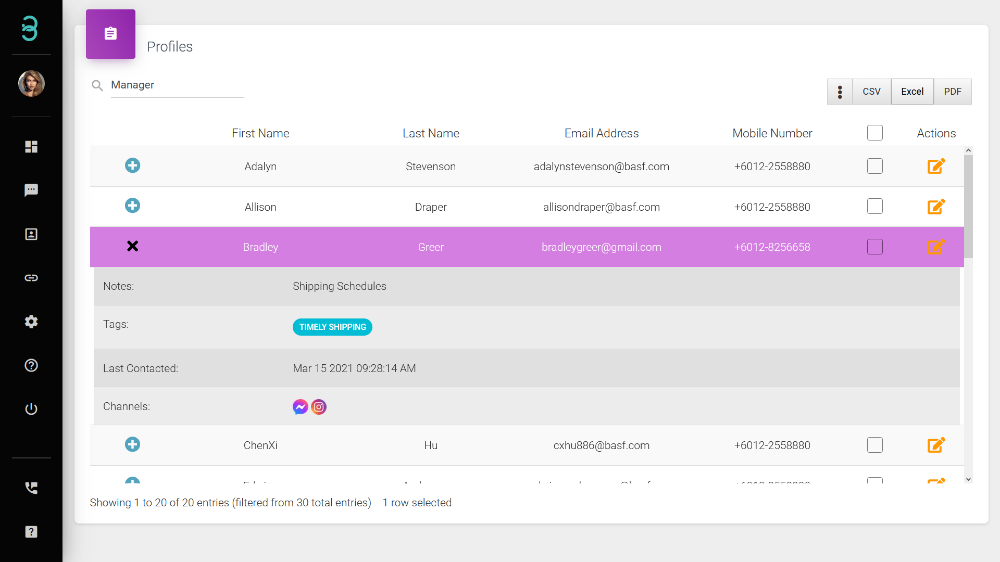
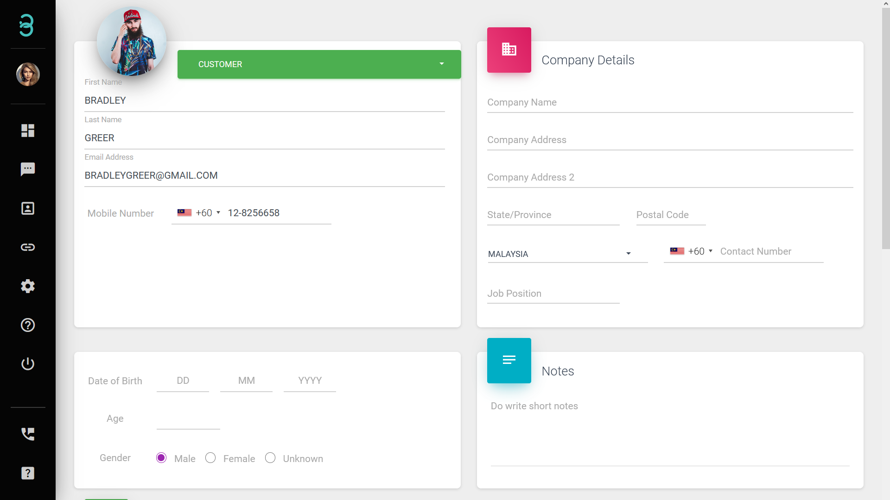

# Adakah mudah untuk mengurus semua 'Active Profiles' saya?

Hanya 2 langkah diperlukan untuk mengurus **'Active Profiles'** anda.

:::tip Bar carian

Bar carian membolehkan anda menapis pelanggan berdasarkan tag dan nota serta mencari pelanggan tertentu.

:::

Langkah 1: Taipkan kata kunci untuk **mencari** profil tertentu. Sebagai contoh, Nama Pertama, E-mel, ataupun Tag. 

Senarai keputusan akan dipaparkan. Untuk memaparkan maklumat lanjut pilih ikon **Kebab** (3 titik menegak). Untuk mengembangkan, pilih ikon **+**.

:::info Update, Delete, or Export

Hanya pengguna yang mempunyai peranan pentadbir akan mempunyai akses penuh.
:::

Langkah 2: Pilih Active Profiles untuk **'Update'**, **'Delete'** atau  **'Export'**.

**'Update'** - Pilih ikon **'Actions'** untuk mengemas kini butiran profil. 

