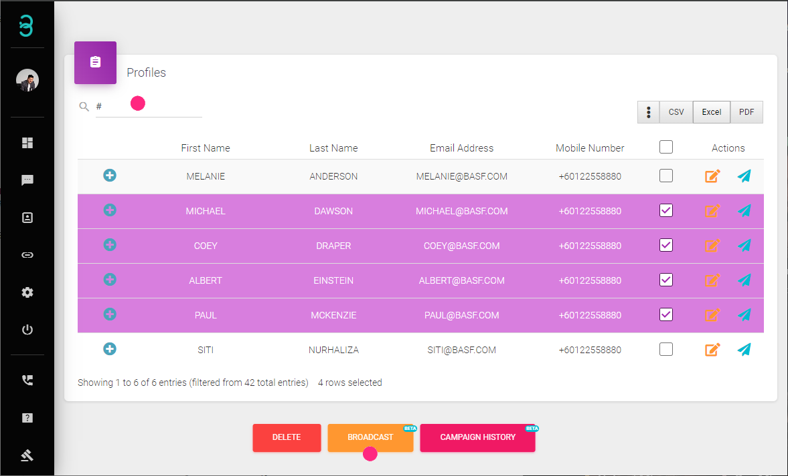

# Bagaimanakah Saya Mengulangi Profil Aktif Saya?

Dengan kemas kini dan perubahan yang berterusan, kita boleh dengan mudah **mengulangi profil aktif** dengan menyebarkan mesej yang dipersonalisasi kepada mereka.

:::tip Bar Carian
Bar carian membolehkan anda menyaring pelanggan berdasarkan tag dan nota, dan juga mencari pelanggan tertentu.
:::

Langkah 1: Cari dan Pilih Profil Sasaran.

Taip kata kunci untuk **mencari** profil tertentu. Ia boleh berupa Nama Pertama, E-mel, atau pun Tag.
Satu senarai keputusan akan dipaparkan. Untuk menunjukkan lebih banyak maklumat, pilih ikon **Kebab** (3 titik tegak).

Pilih Profil Aktif yang ditargetkan untuk **Mengulangi Penyiaran**. Setelah selesai, klik pada butang **Penyiaran**.

Langkah 2: Cipta Kempen Penyiaran.

Cipta Kempen Penyiaran dengan butiran berikut:

- **Campaign Name**: Tajuk untuk kempen penyiaran.
- **Tags (pilihan)**: Tambah tag baru kepada profil aktif yang dipilih selepas penyiaran selesai.
- **Message**: Taip mesej yang ditetapkan dan peribadikannya dengan menyisipkan data dari profil aktif.
- **Message Preview**: Menunjukkan pratonton mesej yang ditetapkan.

:::info Anggaran Masa
Berdasarkan mesej yang ditetapkan, RYCH akan menganggarkan tempoh yang diperlukan untuk menghantar satu mesej serta masa yang diperlukan untuk menyelesaikan keseluruhan kempen.
:::

Langkah 3 (Pilihan): Jadualkan Kempen.

Secara lalai, kempen akan bermula dengan serta-merta. Secara pilihan, anda boleh menetapkan jadual dengan menentukan tarikh dan masa kempen harus bermula.

