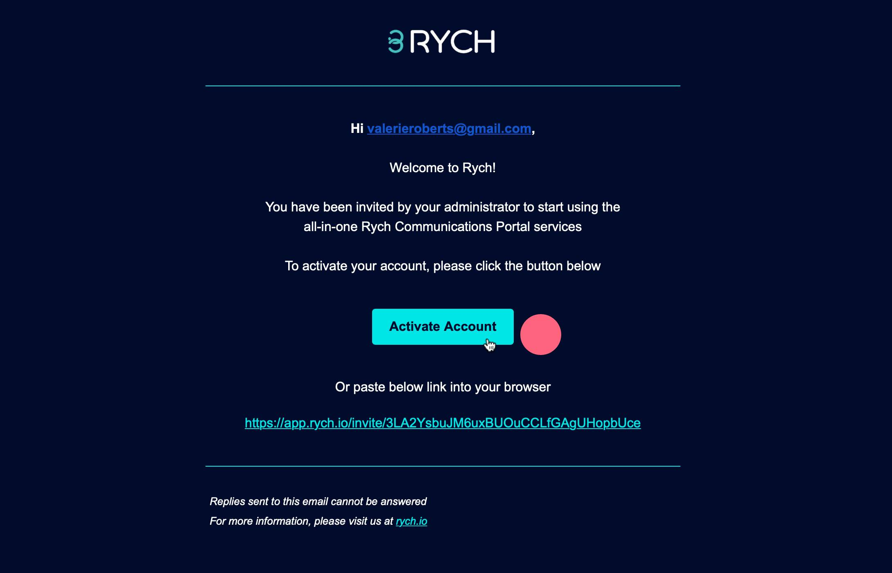

# Bagaimanakah cara saya menjemput pasukan saya untuk menjadi sebahagian daripada pengguna atau "admin" akaun RYCH saya?

Minta pasukan pakar anda bersembang dengan pelanggan anda.

Langkah 1: Klik pada **Invite Users** pada halaman Manage Users untuk menjemput ahli pasukan melalui alamat e-mel.

Langkah 2: Jemputan e-mel akan dihantar, klik pada **Activate Account** atau tampal pautan yang disediakan ke dalam "browser" mereka.

Langkah 3: Lengkapkan borang dan klik **Finish**.

Kini ahli pasukan anda adalah sebahagian daripada Rych yang membantu anda dengan pelanggan.
