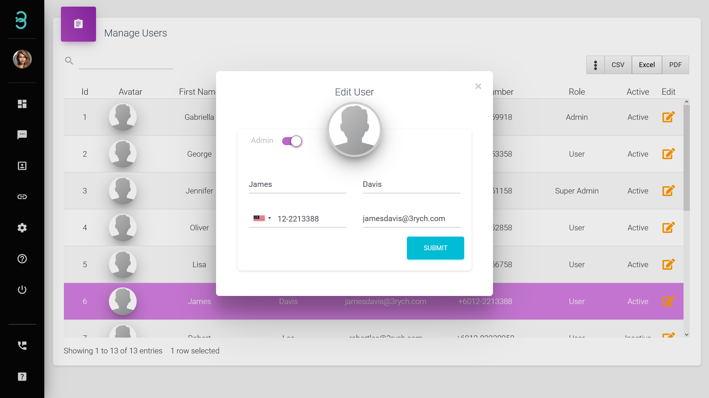

# Bagaimanakah cara saya menjemput atau mengalih keluar pasukan saya dengan peranan pentadbir atau pengguna? 

Dapatkan pasukan pakar anda untuk memberikan pengalaman yang lebih baik kepada pelanggan anda dan pada masa yang sama membina kerjasama pasukan dalaman yang kukuh. 

Langkah 1: Pada bar sisi menu, klik pada **Settings** dan pilih **Manage Users**.

Jemput ahli pasukan melalui alamat e-mel. Anda boleh menjemput ahli pasukan tanpa had, ia dikira sebagai satu (1) 'Active Profile' untuk setiap ahli pasukan.  

Langkah 2: E-mel akan dihantar kepada pengguna yang dijemput, pilih **'Activate Account'** atau tampal pautan yang diberikan ke dalam pelayar.

Langkah 3: Lengkapkan borang maklumat. Kini ahli pasukan anda adalah sebahagian daripada RYCH yang membantu anda dengan pelanggan.

Anda boleh mengalih keluar atau menukar peranan pengguna dengan memilih ikon **Edit**.

