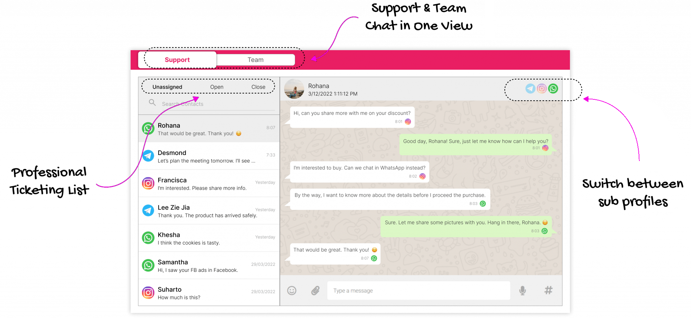

# Mengapa RYCH?

RYCH ialah portal awan komunikasi omnichannel.

Ia sangat kritikal pada hari ini, kerana setiap perniagaan telah menjadi **perniagaan digital**. 
Pengguna telah mengalami perkhidmatan yang disesuaikan daripada jenama lain dan anda hanya mampu bersaing jika anda bermula dengan memanfaatkan teknologi dan data.

Visi kami adalah untuk membolehkan pelanggan kami **mengagregatkan** berbilang saluran komunikasi dalam satu portal supaya kami boleh memudahkan **penyepaduan** data daripada silo individu untuk **menjana** pandangan untuk perancangan & membuat keputusan anda.

# Siapa yang sesuai menggunakan RYCH?

PKS pemula berasaskan digital yang dimulakan & membesar di 'cloud', daripada ibu dan anak kecil kepada perniagaan tradisional yang sedang menuju ke arah **transformasi digital** adalah bakal pelanggan kami.

Perniagaan sedang berusaha untuk menjadi perniagaan digital.

Objektif kami adalah untuk menjadi perniagaan yang **didorong penglibatan**.

# Apakah ciri utama RYCH?

1. Menyambung pelbagai saluran
2. Membolehkan perbualan luaran dan dalaman
3. Pangkalan data profil

# Mari mulakan perjalanan kita untuk menjadi perniagaan yang didorong oleh penglibatan dengan **RYCH**
