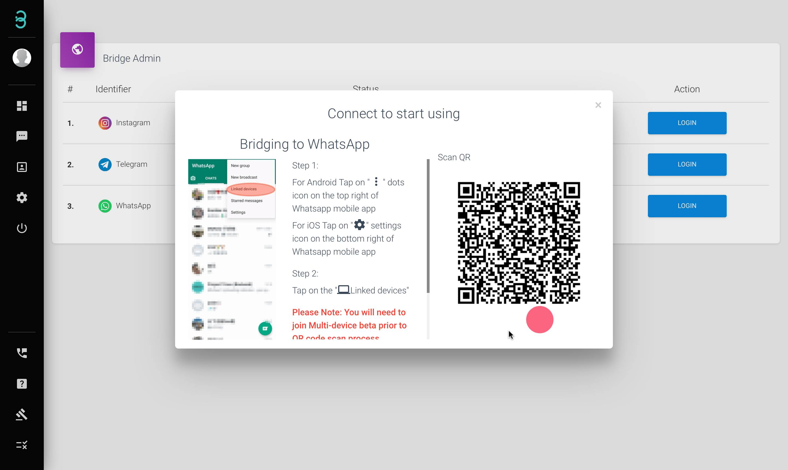

# 如何将我的社交媒体帐户连接到我的 Rych 帐户？

第一步：点击 菜单栏上的 **Bridge\***

:::info Bridge

桥接是将您的社交帐户连接到您的 rych 帐户的地方。只需通过您喜欢的应用程序扫描将出现在屏幕上的二维码，然后开始通过该渠道向您的客户发送消息。

:::

第 2 步：选择您要桥接的频道，然后单击 **Login**\*. 
:::caution 请注意：

要桥接**Instagram**, 您必须关闭 2 因素身份验证 (2FA) 才能连接 Instagram。 至于**Whatsapp** 你必须 **扫描二维码之前加入多设备测试版。**

:::

第三步：屏幕上会出现绿色的Connected状态，表示您的频道桥接成功。

:::caution 请注意：

要桥接**Instagram**, 您必须关闭 2 因素身份验证 (2FA) 才能连接 Instagram。 至于**Whatsapp** 你必须 **扫描二维码之前加入多设备测试版。**

:::