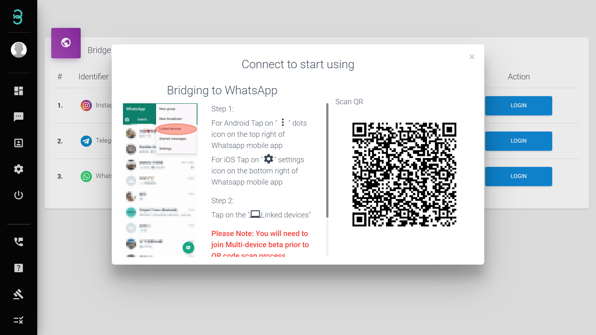

# 如何连接商业社交媒体账户?

:::info 连接（Bridge）

“连接”（Bridge），是连接您的社交媒体账户和我们 RYCH 平台的地方。可通过扫 QR 码或填写用户名和密码来开始与您的客户们聊天。

:::

第一步：在左边工具栏菜单里，点击 **设置（Settings）** 并选择 **连接（Bridge）**。

第二步：选择您想要连接的社交媒体账户

:::caution 请注意 :

连接**Instagram**, 您需要在 Instagram 软件设置中关闭双重身份认证（2 Factor Authentication，2FA）

:::

当按钮成为绿色且显示登录状态为**Connected**时，代表您已连接成功。

