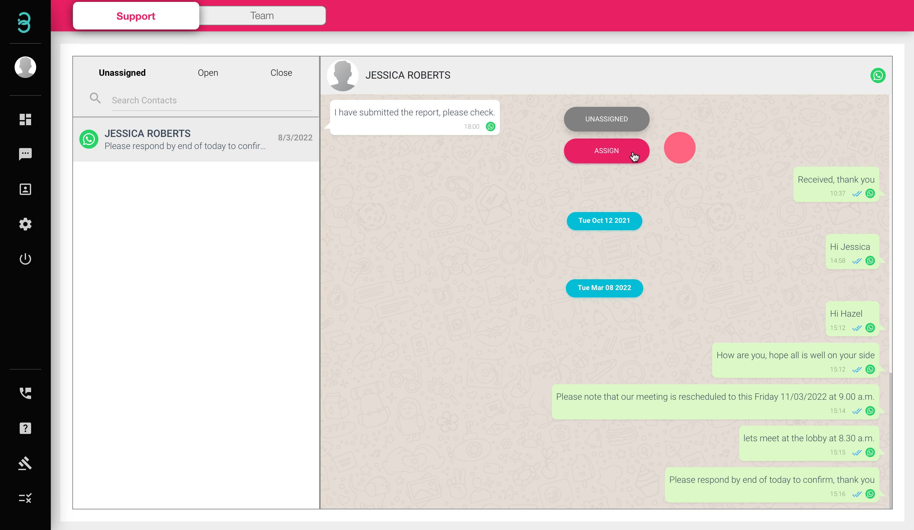
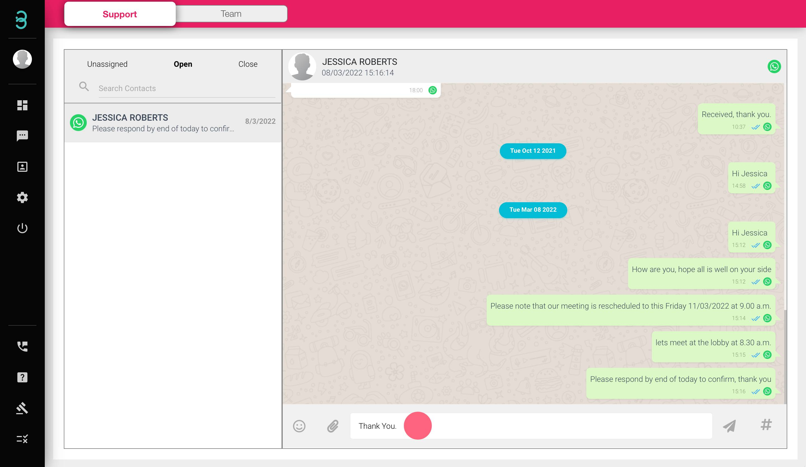
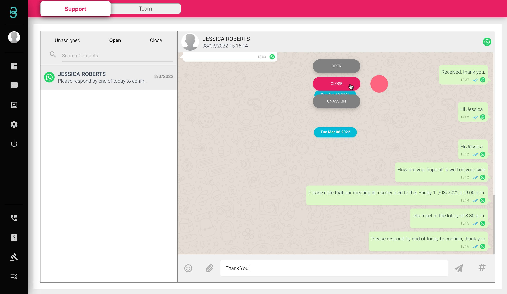

# 如何与新传入的聊天聊天并在完成后关闭它？

在聊天页面上管理新工单的指南。

第 1 步：每个聊天都转换为 **Unassigned tab*** 中的票证。. 择您希望参加的客户，然后单击 **ASSIGN** 按钮开始与他们的对话。

:::info Unassigned
未分配的聊天是您的团队成员尚未参加的聊天。打开选项卡是当前正在参加的聊天

:::

第 2 步：在 **Open** 选项卡中，您可以通过发送文本、表情符号、附件甚至语音便笺来回复客户，以帮助他们解决问题。

第 3 步：解决所有客户查询后，单击 **CLOSE** 按钮关闭工单。

