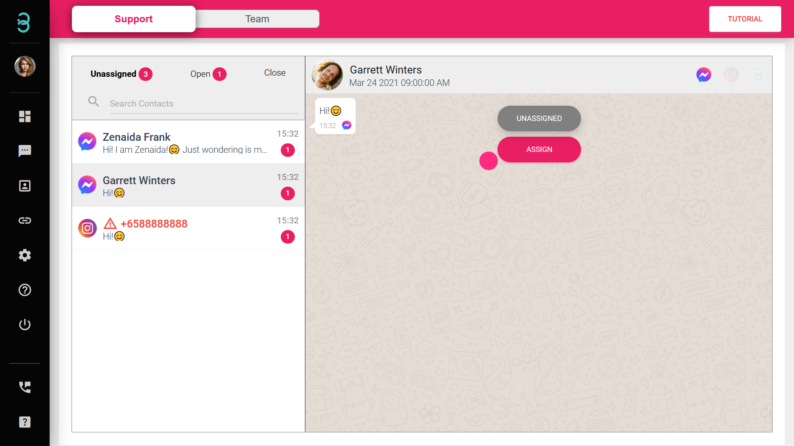
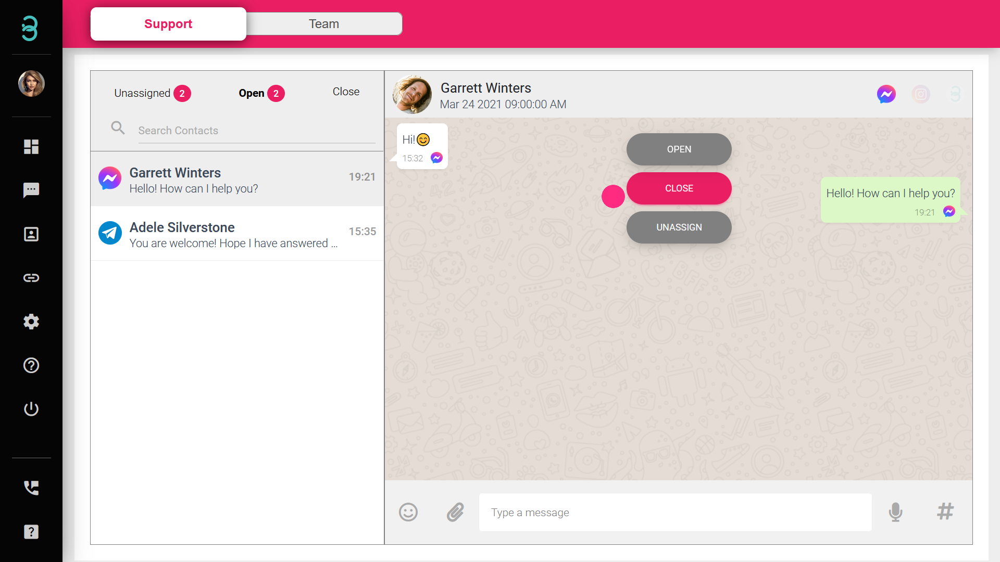

# How do I reply to new incoming messages and close them once I am done?

All new incoming messages are smartly segregated into a list in a single view. There will be 3 professional ticketing lists.

1. **Unassigned** - The “Unassigned” list display messages that are yet to be attended by any of the team members.
2. **Open** - The “Open” list is where your team member will be replying to messages privately.
3. **Close** - Once a team member has successfully solved a customer’s inquiries, moved the message over to the “Close” list.

:::info Unassigned

The “Unassigned” list are messages that are yet to be attended to by any of the team members.

:::

Step 1: Select a message, hover to and select the **ASSIGN** button. 

Start engaging with your customers by sending text, emojis, attachments, and even voice notes, and give them a great customer experience. 

:::info Open

The “Open” list is where your team member will be replying to messages privately. An admin will be able to view and reply to the same message. 

:::

:::info Close

Once a team member has successfully solved a customer’s inquiries, moved the message over to the “Close” list.

:::

Step 2: When you have made the customer feel happy and satisfied, hover to and select the **CLOSE** button.

