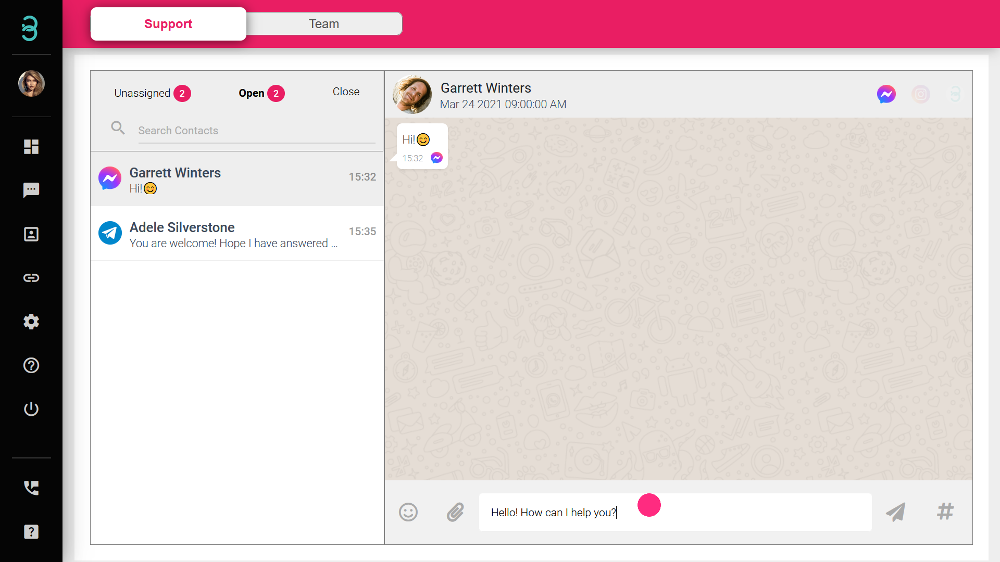

# 如何回复新聊天信息并在结束对话后关闭?

所有的新信息将会被划分入下列三种信息列表：

1. **未分配（Unassigned）** - 所有未被成员回复的新聊天将会被分配到此列表中。
2. **已分配（Open）** - 将聊天室移动到“已分配”列表后，您和您的成员即可回复聊天信息。
3. **已结束（Close）** - 当聊天室对话结束后，可将聊天室移动到“已结束”列表

:::info 未分配 Unassigned

“未分配”列表里的聊天室代表并未有任何成员对于这些聊天进行回复。

:::

第一步：选择一个聊天室并移动您的鼠标，点击**ASSIGN**按钮。

通过发送信息、表情符号、文件和语音信息来与您的顾客们互动，并向他们提供良好的用户体验吧！

:::info 已分配 Open

如要回复信息，可到“已分配”列表进行回复。拥有管理员（admin）身份的成员，可通过“已分配”列表查看当前成员与顾客的聊天内容。

:::

:::info 已结束 Close

当您已顺利解决您的顾客要求后，将聊天室移到“已结束”列表。

:::

第二步：当您和您的顾客愉快的结束对话后，可移动鼠标并点击**CLOSE**按钮即可讲对话移到”已结束“列表。

