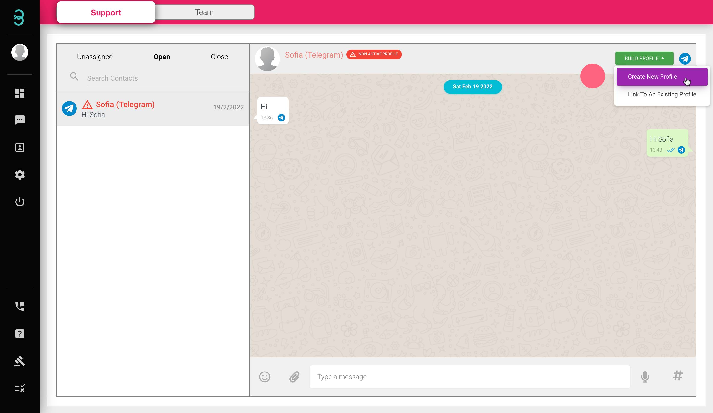
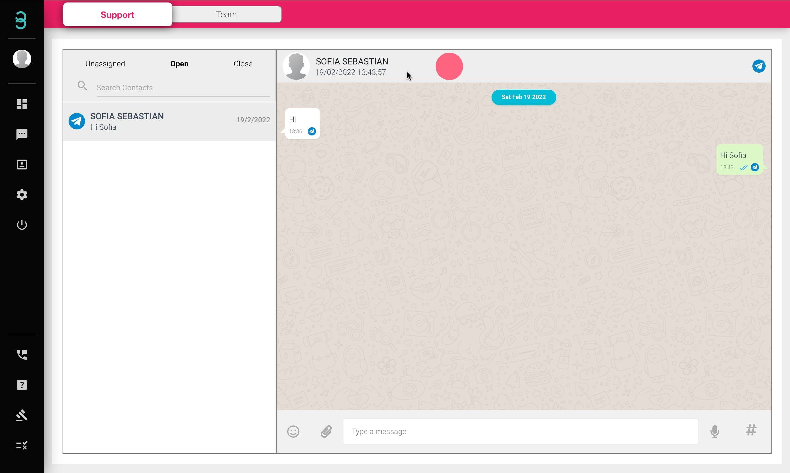

# 如何通过聊天页面将客户资料添加到我的数据库中？

不要错过潜在的未来客户。只需在您通过这些步骤与他们聊天时添加他们的个人资料。

第 1 步：单击带有 **红色字体*** 的客户聊天框， 然后单击绿色的 **BUILD PROFILE** 按钮并单击 Create New Profile.

:::tip 红色字体

如果客户姓名以红色显示并带有危险标志，则表示该联系人在您的数据库中没有个人资料。在您的个人资料数据库中添加联系人后，联系人的姓名将显示为黑色。

:::

第 2 步：填写客户的所有必填信息，然后单击 **蓝色的提交** 按钮。

第 3 步：创建配置文件后，您的客户名称将以黑色文本显示。

