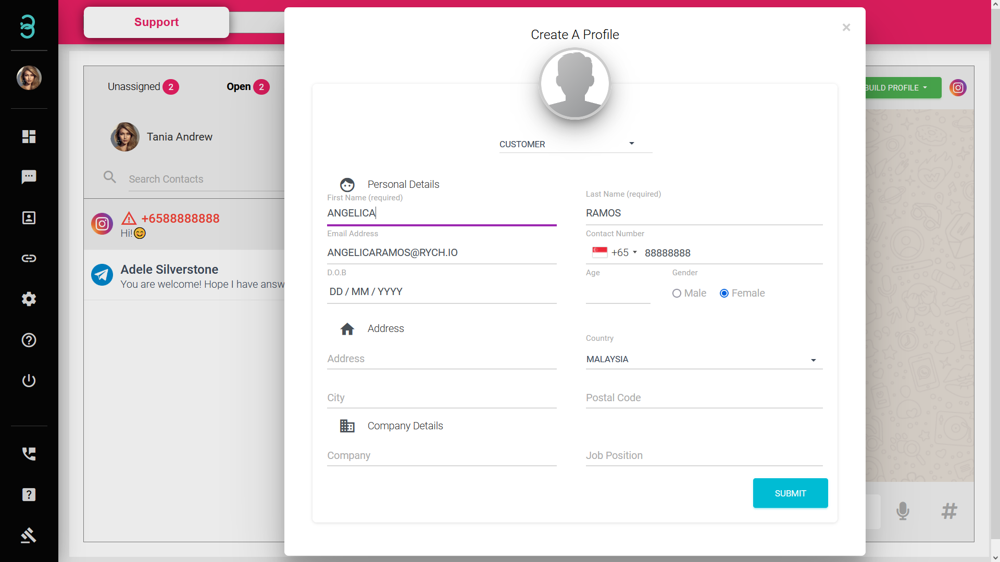

# 如何在聊天页面创建或连接个人资料?

**已激活用户（Active Profile）** 创建后，您即可启用本平台提供的客户资料自动化功能、浏览历史聊天信息等功能。
还未连接或创建的用户个人资料，**未激活用户（non-Active Profile）**，其聊天内容将会与 24 小时后被删除。

:::tip 红色字体

若聊天室名字呈红色字体和红色三角形感叹号，代表此聊天室为“未激活用户”（non-Active Profile）。反之，聊天室名字呈黑色，代表此聊天室为“已激活用户”（Active Profile）。

:::

第一步：选择 **创建个人资料（BUILD PROFILE）** 按钮并选择 **创建新资料（Create New Profile）** 或 **连接现有资料（Link to An Existing Profile）**。此步骤只能在聊天室已移到“未分配”（Open）聊天室列表时才能进行。

第二步：**创建新资料（Create New Profile）** - 填写您的顾客资料。资料填写的越多，越能建立更好的用户体验！

**连接现有资料（Link to An Existing Profile）** - 搜索并选择您现有的 **已激活用户（Active Profile）**后，连接已选择的聊天室，“子用户”（sub-profile）。现在，您可通过 RYCH 聊天页面查看您与顾客在所有不同社交媒体的聊天内容。

