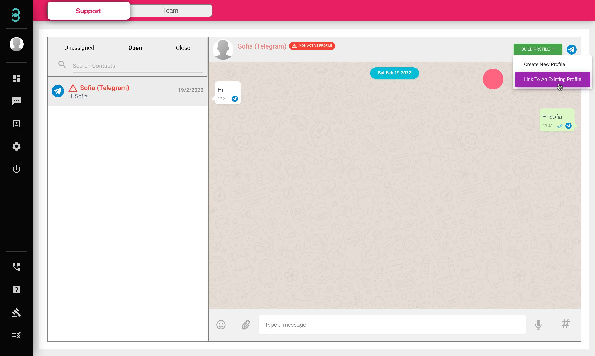
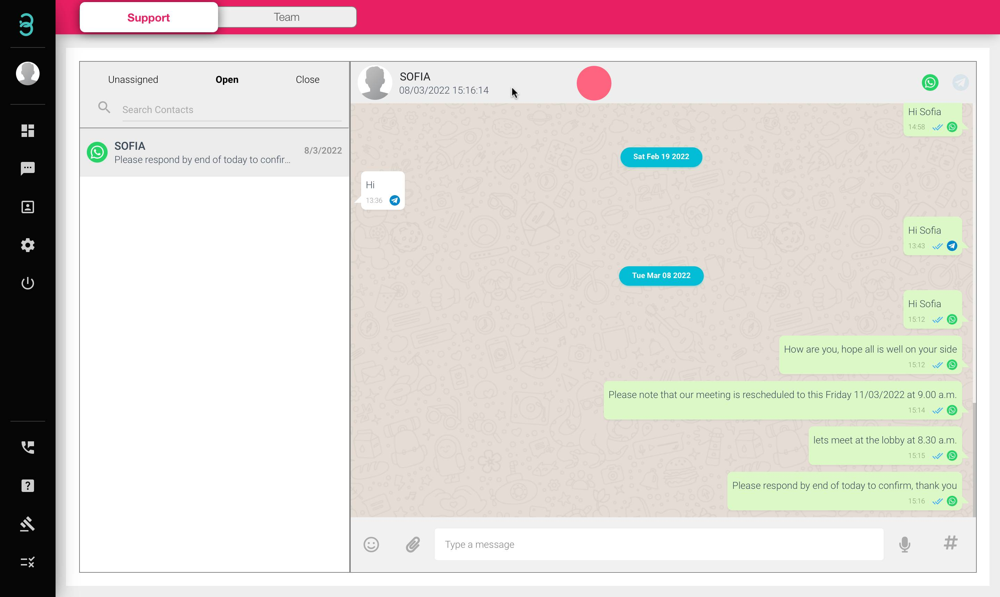

# 如何在同一个人资料下链接来自不同渠道的现有客户个人资料？

如果您收到来自现有客户的新消息并且来自不同的渠道，请使用这些步骤链接到现有配置文件。

第 1 步：单击新的 **聊天名称（红色字体）*** 由现有客户发起，然后单击绿色的 **Build Profile** 按钮，其中将有一个选项链接到现有配置文件。

:::tip 红色字体

如果客户姓名以红色显示并带有危险标志，则表示该联系人在您的数据库中没有个人资料。在您的个人资料数据库中添加联系人后，联系人的姓名将显示为黑色。
:::

第 2 步：搜索您的客户的个人资料并单击它。现在，您将能够在同一个聊天窗口中从不同渠道与您的客户聊天。

第 3 步：每次对话结束时都会出现频道标志（在本例中为 WhatsApp）。

