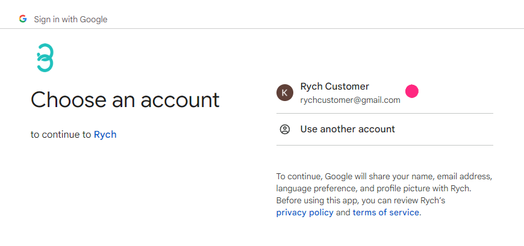
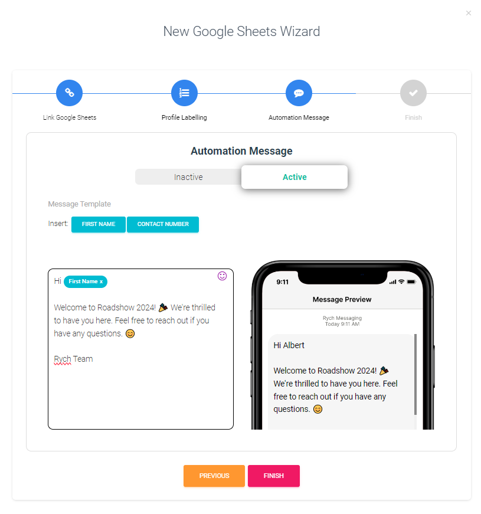
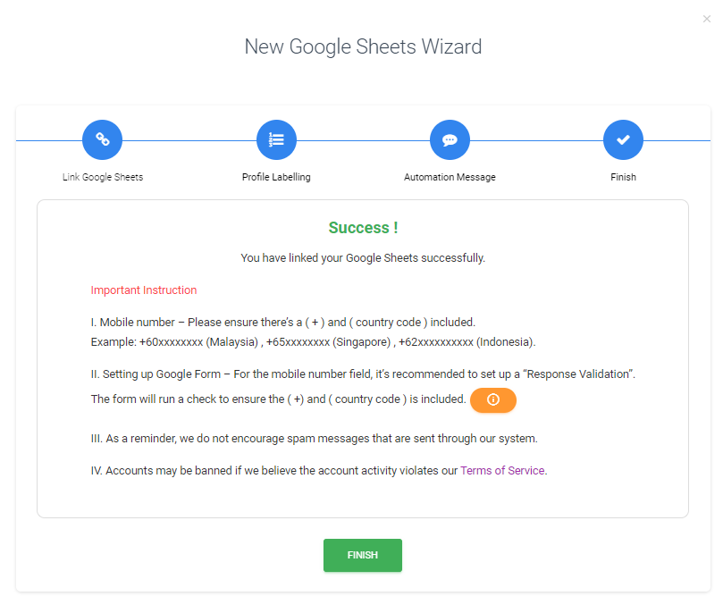

# 如何连接 Google 表格？

Rych 可以从预选的 Google 表格中读取内容，自动向新条目发送“欢迎消息”。此功能通常与 Google 表单一起使用，其中 Google 表单中的新条目会更新到 Google 表格中，然后 Rych 会捕捉到。这在客户填写包含联系方式的表单的活动或演示中特别有用。

:::info 姓名和联系方式
由于 Rych 将客户详细信息保存到活跃配置文件中并自动发送欢迎消息，因此至少需要提供名字和联系方式。
:::

步骤 1：连接到 Google 表格

1. **使用 Google 帐号登录**：
   - 点击“使用 Google 帐号登录”。

   

   - 点击“授权”。

   

   - 选择您的 Google 表格帐号。

   

   - 点击“继续”。

   

   - 勾选“查看所有您的 Google 表格电子表格”的复选框，然后点击“继续”。

   
      
   登录成功后，状态将显示为“已登录为...”。

   

步骤 2：选择相关的 Google 表格电子表格

1. **打开新 Google 表格向导**：
   - 点击“+”开始“链接 Google 表格”过程。

   

2. **链接 Google 表格**：

    

   - **电子表格标题**：选定电子表格的标题。
   - **电子表格网址**：目标 Google 表格的网址。参考下一个指南，“创建 Google 表格”，了解如何获取网址。
   - **# 添加标签**：通过此 Google 表格创建的配置文件添加新标签。稍后可以在**重新接触广播**中使用这些标签。

   完成后，点击“下一步”。

3. **配置配置文件标签**：
   - 使用正确的数据类型标记各列。从此电子表格生成的所有新数据将根据分配的数据标签保存为活跃配置文件（例如，名字、联系电话、电子邮件、公司名称等）。最少需要的数据是“名字”和“联系电话”。

   

   示例标签：
   - 将电子表格列“姓名”标记为 Rych 中的“名字”。
   - 将电子表格列“电话号码”标记为 Rych 中的“联系电话”。
   - 将电子表格列“时间戳”设置为“忽略”，因为这些数据不会保存在活跃配置文件中。

    :::info 数据类型
    您可以将预定义的电子表格列链接到相应的数据类型。如果数据类型不可用，请选择“其他”并输入数据类型的新标题，该标题将存储在活跃配置文件的“备注”中。
    :::
   
   完成后，点击“下一步”。

4. **自动化消息**：
   - 自定义欢迎消息。这条欢迎消息将根据检索的电子表格数据通过 WhatsApp 发送。

   

   - **消息模板**：输入指定消息并通过之前分配的配置文件标签插入数据以个性化消息。
   - **消息预览**：显示指定消息的预览。

   完成后，点击“完成”。

**您已成功链接 Google 表格电子表格**

:::caution 重要提示
1. **手机号码格式**：确保包含“+”和国家代码。
   - 示例：+60xxxxxxxx（马来西亚）、+65xxxxxxxx（新加坡）、+62xxxxxxxxxx（印度尼西亚）。
2. **垃圾邮件提醒**：我们不鼓励通过我们的系统发送垃圾消息。
3. **服务条款**：如果我们认为帐户活动违反了我们的[服务条款](https://rych.io/terms-of-service-rych)，帐户可能会被禁止使用。
:::

点击“完成”关闭向导。
