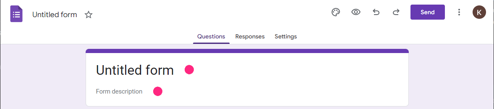
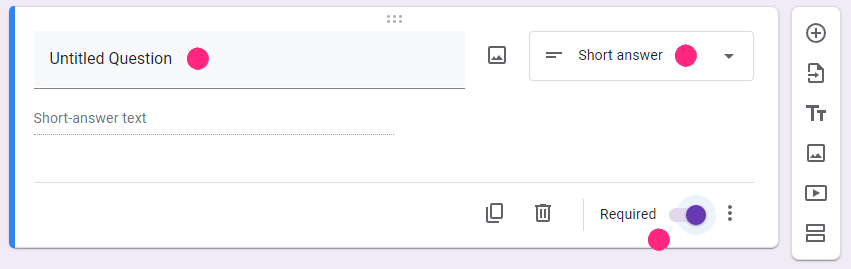
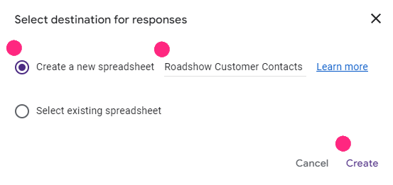

# 逐步指南：创建一个 Google 表单以获取客户联系方式并输出到 Google 表格

步骤 1：创建一个 Google 表单

1. **打开 Google 表单**：进入 [Google 表单](https://forms.google.com)，然后点击 `+` 按钮创建一个新表单。

   

2. **标题和描述**：
   - 为您的表单输入一个标题，例如，“客户联系方式 - 路演”。
   - 提供一个描述，例如，“请填写您的联系方式，以便我们保持联系”。

   

3. **添加问题**：
   - 点击 `未命名问题` 字段以添加新问题。
   - 对于 **姓名** 字段：
     - 将问题类型选择为 `短回答`。
     - 输入问题文本，例如，“姓名”。
     - 通过切换 `必填` 开关来将其标记为必填字段。

   

   - 对于 **联系方式** 字段：
     - 将问题类型选择为 `短回答`。
     - 输入问题文本，例如，“联系方式（电话）”。
     - 通过切换 `必填` 开关来将其标记为必填字段。

   

   :::info 最低要求字段
    Rych 需要至少 “姓名” 和 “联系方式” 两个字段才能工作。您可以继续上述步骤添加更多问题，以进一步完善活跃档案数据，以更好地了解您的客户。
    :::

4. **可选：为联系方式设置验证**：
   - 点击联系方式问题右下角的三个点 (`⋮`)。
   - 选择 `响应验证`。
   - 在响应验证设置中：
     - 从下拉菜单中选择 `正则表达式`。
     - 选择 `匹配`。
     - 输入正则表达式：`\+(9[976]\d|8[987530]\d|6[987]\d|5[90]\d|42\d|3[875]\d|2[98654321]\d|9[8543210]|8[6421]|6[6543210]|5[87654321]|4[987654310]|3[9643210]|2[70]|7|1)\d{1,14}`。
     - 提供自定义错误消息，例如，“请输入有效的国际电话号码”。

   

步骤 2：将 Google 表单链接到 Google 表格

1. **链接到表格**：
   - 点击 `回复` 选项卡。
   - 点击绿色的表格图标以创建一个新的电子表格。

   

2. **创建电子表格**：
   - 选择 `创建新的电子表格` 并适当命名，例如，“路演客户联系”。
   - 点击 `创建`。

   

步骤 3：访问 Google 表格的 URL

1. **打开 Google 表格**：
   - 一旦表单链接到新的 Google 表格，电子表格将自动打开。
   - 您浏览器地址栏中的 URL 就是您的 Google 表格电子表格的链接。
   - 选择 URL 并复制 URL 地址

   

2. **将 Google 表格链接到 Rych**：

    在向导的此阶段，请将上述复制的 URL 粘贴到 **电子表格 URL** 字段中。

    

   - **电子表格 URL**：目标 Google 表格的 URL。有关如何获取 URL，请参阅下一个指南，**创建一个 Google 表格**。
   - 您可以参考 **连接 Google 表格** 指南。

结论

通过按照这些步骤，您已成功创建了一个 Google 表单以捕获客户联系方式（例如路演活动的示例），并将其链接到了一个 Google 表格电子表格。现在，您可以收集回复并直接在 Google 表格中访问它们。
