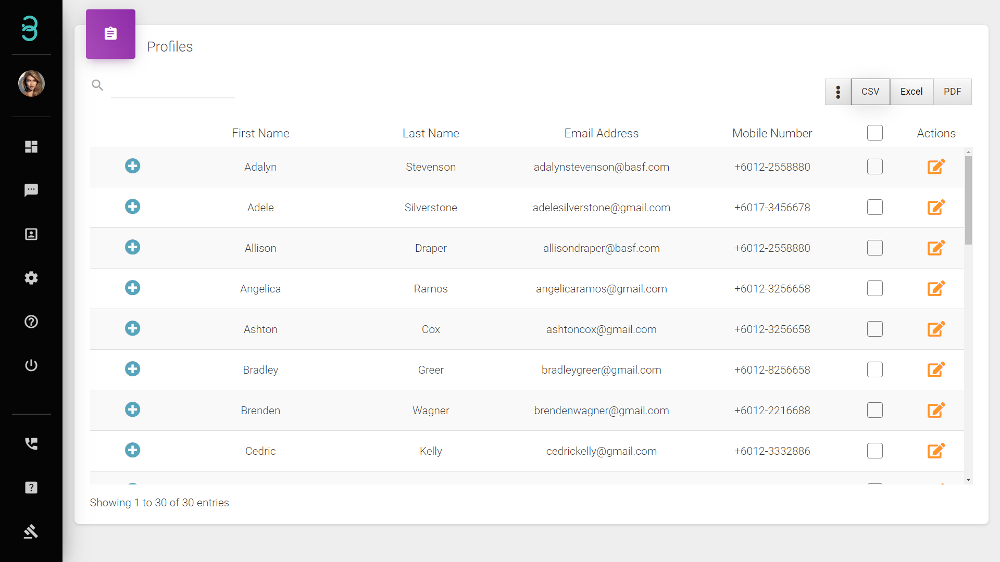

# 我有客户的信息，但如何在没有客户要求的情况下创建个人资料？

第 1 步：在 Profiles 页面上，单击页面底部的 Create 按钮。

第2步: 单击绿色按钮将配置文件归类为客户或供应商。

第 3 步: 填写所需信息，添加 **标签*** 或注释以对客户进行分类。

:::info 标签

标签是主题标签 (#)，您可以在客户资料上添加标签，这将帮助您对特定客户进行分类，以便您轻松搜索它们。
:::

Step 4: 最后点击页面底部的 **提交**按钮, 成功将客户资料添加到您的数据库中。

