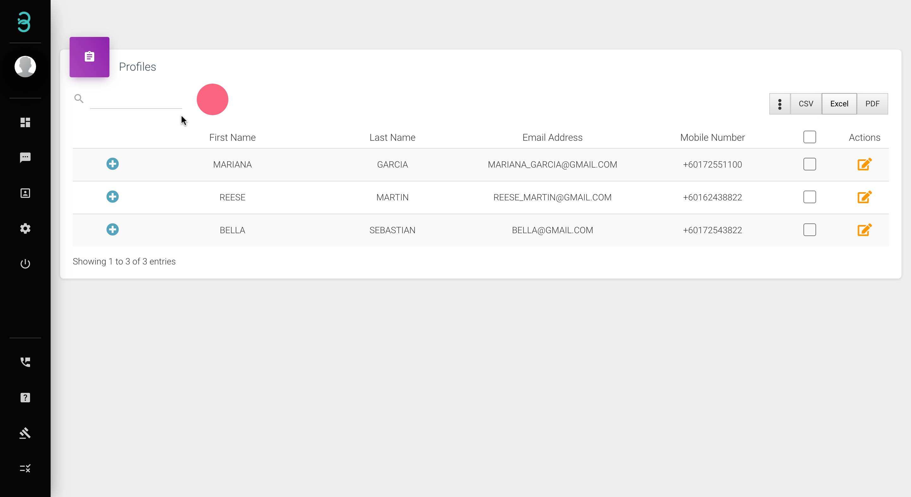

# 我有很多客户资料，管理所有这些资料是否简单？

只需 3 个步骤即可管理您的客户资料

第 1 步：在**搜索******* 栏中输入关键字以识别特定客户。单击 + 符号可查看汇总信息下拉列表。

:::tip 搜索栏

搜索栏允许您根据标签和注释过滤客户以及搜索特定客户
:::

第 2 步：单击 **CSV, Excel 或 PDF 按钮**导出您的客户数据库。.*****

:::info CSV、Excel 或 PDF 按钮

单击 CSV、Excel 或 PDF 将您的客户资料数据库导出为您喜欢的格式。
:::

第 3 步：单击“操作”按钮将进入个人资料页面，您可以在其中编辑现有客户的个人资料。

通过 Rych 管理客户资料就这么简单。
