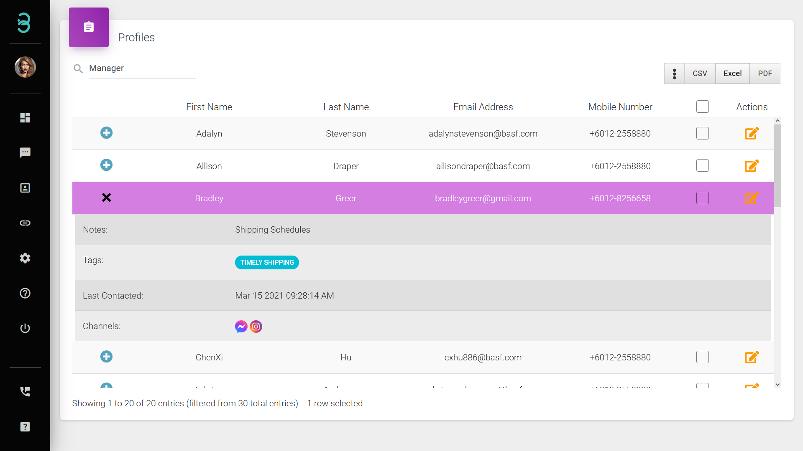

# 是否能简单的管理我的 **“已激活用户” （Active Profile）**?

是的，管理您的 **“已激活用户” （Active Profile）**，只需两个简单的步骤！

:::hint 搜索栏

在搜索栏中，可根据标签（tag）和注释（notes）筛选与搜索您的客户。

:::

第一步：在搜索栏中填写关键字，姓名、邮件地址、甚至标签（Tags）等，来**搜索**特定客户。

搜索时，列表内容将会通过所填写的搜索关键字来进行筛选。若要查询更多客户资料，可点击 **⋮** 符号；若要详细资料也可点击 **+** 符号。

:::info 更新、删除或导出

只有拥有管理员权限的成员才可拥有更新、删除或导出的权限。

:::

第二步：**更新（Update）**, **删除（Delete）** 或 **导出（Export）** “已激活用户” （Active Profile）资料。

**更新（Update）** - 选择 **Actions** 栏中的符号后即可更新客户资料。

