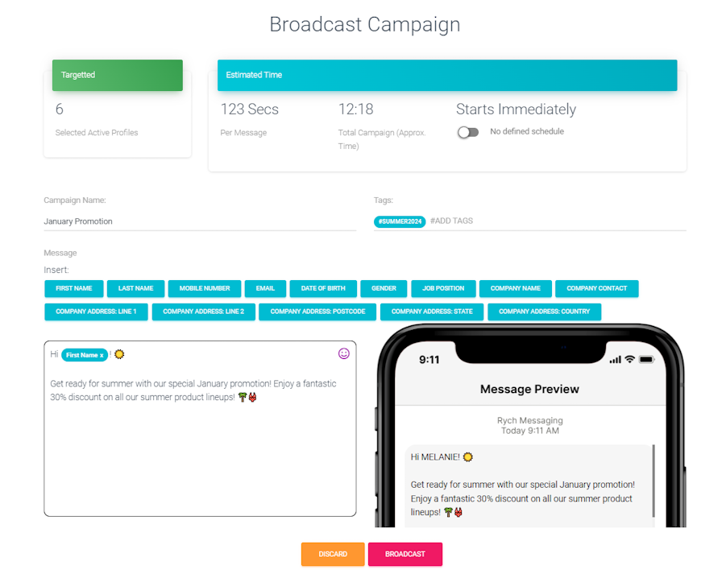
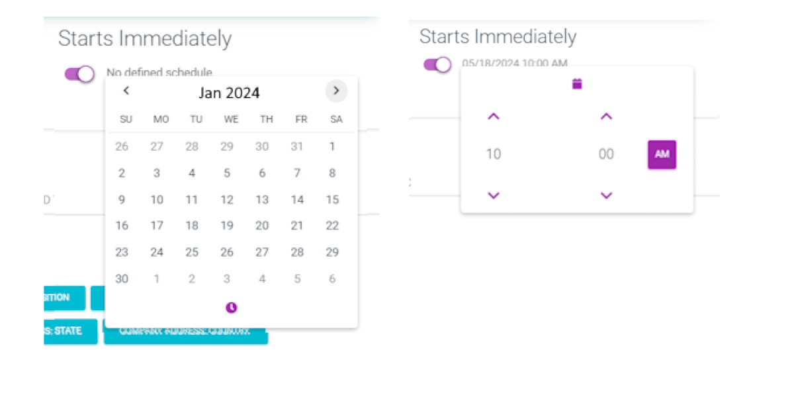

# 如何重新接触我的活跃档案？

随着不断的更新和变化，我们可以通过向他们广播个性化消息来轻松地 **重新接触活跃档案**。

:::tip 搜索栏
搜索栏允许您根据标签和注释过滤客户，以及搜索特定客户。
:::

第 1 步：搜索并选择目标档案。

键入关键字来 **搜索** 特定档案。它可以是名字、电子邮件，甚至标签。 
将显示一系列结果。要显示更多信息，请选择 **Kebab** 图标（3个垂直点）。

选择目标活跃档案进行 **重新接触广播**。完成后，点击 **广播** 按钮。

第 2 步：创建广播活动。

使用以下细节创建广播活动：

- **活动名称**：广播活动的标题。
- **标签（可选）**：在广播完成后向选定的活跃档案添加新标签。
- **消息**：输入指定消息并通过从活跃档案插入数据进行个性化。
- **消息预览**：显示指定消息的预览。

:::info 预估时间
基于指定消息，RYCH 将估算发送单个消息所需的时间以及完成整个活动所需的时间。
:::

第 3 步（可选）：安排活动。

默认情况下，活动将立即开始。可选择通过定义活动应开始的日期和时间来设置日程安排。

