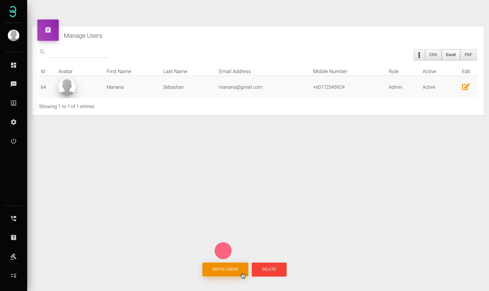
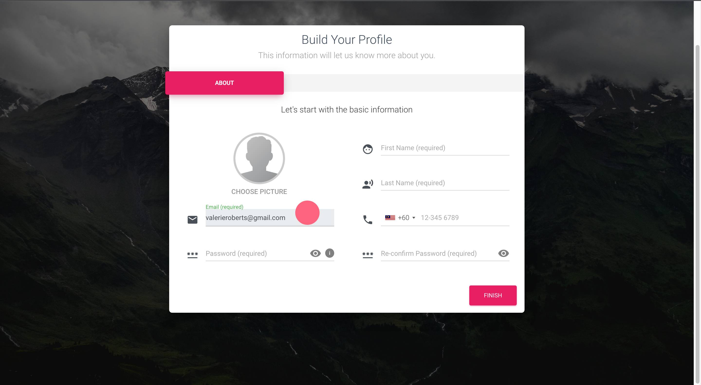

# 如何邀请我的团队成为我的 RYCH 帐户用户或管理员的一部分？

让您的专家团队与您的客户聊天。

第 1 步：单击“管理用户”页面上的 **Invite users** 以通过电子邮件地址邀请团队成员。

第 2 步：将发送一封电子邮件邀请，单击 **Activate Account** 或将提供的链接粘贴到他们的浏览器中。

第 3 步：填写表格并点击 **Finish**.

现在，您的团队成员是 Rych 的一员，可协助您处理客户。