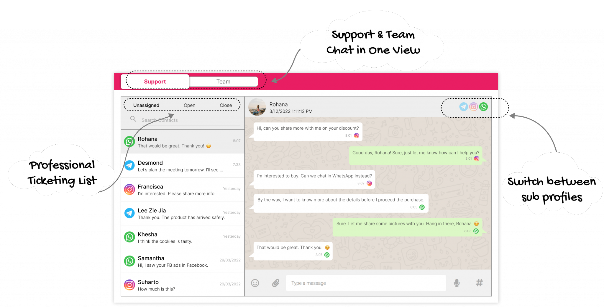

# 为什么使用 RYCH?

RYCH 是一个云全通路通訊平台。

如今，越来越多的企业已日益电子化。为了提升竞争能力，我们只能通过科技与各项数据来给予客户更好的个性化服务体验。

我们的目标是，通过集合用户的各个社交软件聊天室来收集各项数据以便您能更好的为您的客户提供更好的决策与意见。

<!-- Our vision is to allow our customers to **aggregate** multiple communication channels in a single portal so we can easily **integrate** data from individual silos to **generating** insights for your planning & decision-making. -->

# 谁该使用 RYCH?

正准备使用或已使用电子商务的中小型企业及正想从传统型转变成电子型的企业都适用。以通过与顾客的沟通**建立更良好的关系**为目标。

<!-- SMEs of a digital-native startup who is born & breed on the cloud, from small mom-and-pop to traditional businesses who are on their **digital transformation** journey are our potential customers. -->

<!-- Businesses are putting effort into becoming a digital business.

The objective is to become an **engagement-driven** business. -->

# RYCH 的关键作用是什么?

1. 连接不同的社交媒体
2. 启用外部和内部聊天
3. 分析数据库

# 现在和我们**RYCH**以建立良好关系为目标，一起开启新的旅程吧！

<!-- # Let's start our journey to becoming an engagement-driven business with **RYCH** -->
